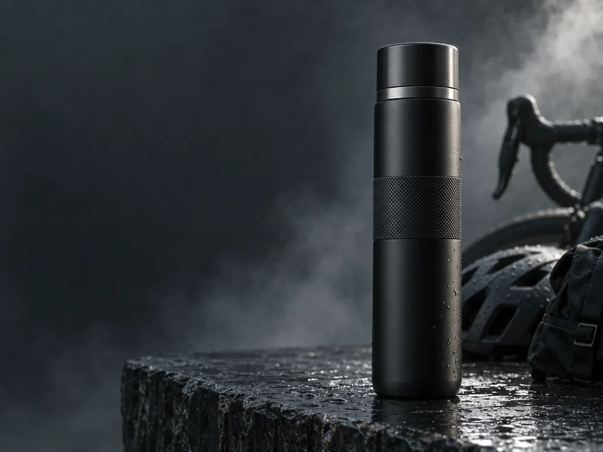

<!-- Built from data/prompts.json and locales/en.json by `node scripts/build.mjs`.
     Edit the source, not this file; `--check` fails CI on a hand edit. -->

# GPT Image 2.5 advertising and campaign prompts

Campaign key visuals, banners and social ad creative. Most of these carry both an image direction and a piece of copy to render, which is why they belong to this model rather than to a generation that could not spell.

<p align="center"></p>

**[Open the 17 prompts](https://youart.ai/gpt-image-2-5-prompts?utm_source=github&utm_medium=category&utm_campaign=awesome-gpt-image-2-5-prompts&utm_content=ad-creative#ad-creative)**

[Awesome GPT Image 2.5 Prompts](../README.md) · [Browse by use case](../README.md#browse) · [How to write a GPT Image 2.5 prompt](../README.md#guide)

GPT, GPT Image and ChatGPT are trademarks of OpenAI. YouArt is an independent platform and is not affiliated with or endorsed by OpenAI. GPT Image 2.5 is still rolling out and is not yet open to every account; when it opens, these prompts move across unchanged.

---

<a id="p-4-panel-japanese-digital-ad-banner-grid"></a>

## 4-Panel Japanese Digital Ad Banner Grid

[@makaneko\_AI](https://x.com/makaneko_AI) · [x.com](https://x.com/makaneko_AI/status/2045764016858087720) · [`evolink`](https://github.com/EvoLinkAI/awesome-gpt-image-2-API-and-Prompts/tree/e2a269ad1a055a0b4f6c1e170341c6c1aba30faa)

```json
{
  "type": "2x2 grid of Japanese digital advertisement banners",
  "layout": {
    "structure": "4 equal quadrants",
    "quadrants": [
      {
        "position": "top-left",
        "theme": "Travel",
        "subject": "A couple holding hands on a white sand beach, looking out at turquoise ocean water under a bright blue sky.",
        "elements": ["red hibiscus flower in bottom left corner"],
        "text_labels": [
          "今年こそ、解き放て。",
          "{argument name=\"travel destination\" default=\"沖縄旅行\"}",
          "3日間の癒やし旅",
          "航空券+ホテル",
          "39,800円〜",
          "絶景、グルメ、体験 ぜんぶ叶う!"
        ],
        "icons": {
          "count": 3,
          "descriptions": ["airplane", "hotel building", "car"]
        }
      },
      {
        "position": "top-right",
        "theme": "Skincare",
        "subject": "Close-up portrait of a young woman with glowing, dewy skin, eyes closed, gently touching her cheeks.",
        "elements": [
          "soft pink gradient background",
          "dynamic water splash effects",
          "pink cosmetic jar labeled '{argument name=\"skincare product name\" default=\"LUMIÈRE\"} Brightening Gel'"
        ],
        "text_labels": [
          "毛穴・くすみ卒業!",
          "透明感あふれる",
          "水光肌へ",
          "新感覚スキンケア",
          "初回限定 78%OFF",
          "{argument name=\"discount price\" default=\"1,980円\"}"
        ],
        "badges": {
          "count": 3,
          "style": "gold circular",
          "labels": ["毛穴ケア", "高保湿", "ハリ・ツヤ"]
        }
      },
      {
        "position": "bottom-left",
        "theme": "Gourmet Food",
        "subject": "Thick, sliced, medium-rare steak sizzling on a dark grill plate.",
        "elements": [
          "garlic chips",
          "rosemary sprig",
          "dark background with smoke and glowing embers"
        ],
        "text_labels": [
          "とろける旨さ!",
          "{argument name=\"food item\" default=\"黒毛和牛\"}",
          "贅沢ステーキ",
          "期間限定",
          "特別価格",
          "通常価格 8,980円",
          "4,980円"
        ],
        "badges": {
          "count": 1,
          "style": "red circular",
          "labels": ["A4 A5等級"]
        }
      },
      {
        "position": "bottom-right",
        "theme": "Online Education",
        "subject": "Young man in a blue shirt studying at a desk, writing in a notebook next to an open laptop.",
        "elements": ["bright indoor lighting", "desk environment"],
        "text_labels": [
          "スキマ時間で",
          "{argument name=\"education goal\" default=\"最短合格!\"}",
          "オンライン資格講座",
          "スマホで完結",
          "効率学習で差がつく!",
          "今だけ! 受講料 20%OFF"
        ],
        "badges": {
          "count": 1,
          "style": "blue circular",
          "labels": ["受講者数 10万人 突破!"]
        },
        "icons": {
          "count": 2,
          "descriptions": ["smartphone", "open book"]
        }
      }
    ]
  }
}
```

[Open the generator](https://youart.ai/gpt-image-2-5-prompts?utm_source=github&utm_medium=prompt&utm_campaign=awesome-gpt-image-2-5-prompts&utm_content=4-panel-japanese-digital-ad-banner-grid#4-panel-japanese-digital-ad-banner-grid)

<a id="p-anime-character-brand-identity-merch-board"></a>

## Anime Character Brand Identity \& Merch Board

[@chi\_vc\_](https://x.com/chi_vc_) · [x.com](https://x.com/chi_vc_/status/2046061073720369228) · [`evolink`](https://github.com/EvoLinkAI/awesome-gpt-image-2-API-and-Prompts/tree/e2a269ad1a055a0b4f6c1e170341c6c1aba30faa)

```json
{
  "type": "brand identity and merchandise design board",
  "theme": {
    "color_palette": "{argument name=\"theme color\" default=\"pastel pink\"} and white",
    "motif": "{argument name=\"motif\" default=\"cherry blossoms\"} and pink hearts"
  },
  "character": {
    "description": "anime girl with short brown bob hair, pink eyes, wearing a white hoodie, gentle smile"
  },
  "branding": {
    "main_logo": "{argument name=\"character name\" default=\"癒音ちー\"}",
    "sub_logo": "{argument name=\"character subtext\" default=\"ゆおんちー\"}"
  },
  "layout": {
    "sections": [
      {
        "type": "header banner",
        "position": "top",
        "elements": ["large main logo", "sub logo", "cherry blossom graphics", "character portrait on the right"]
      },
      {
        "type": "product packaging",
        "position": "middle left",
        "elements": ["1 square box with heart-shaped transparent window showing pink heart candies", "character illustration on box", "2 individual candy wrappers", "5 scattered heart candies"]
      },
      {
        "type": "promotional poster",
        "position": "middle right",
        "elements": ["character portrait", "heart-shaped candy bowl", "main logo", "text '4.26 NEW OPEN'", "text '{argument name=\"social handle\" default=\"@yuonchii\"}'"]
      },
      {
        "type": "horizontal web banner",
        "position": "lower middle",
        "elements": ["main logo", "cherry blossoms", "character portrait on the right"]
      },
      {
        "type": "social media profile mockup",
        "position": "bottom left",
        "elements": ["header image with logo", "1 circular profile picture", "handle '{argument name=\"social handle\" default=\"@yuonchii\"}'", "1 follow button", "mock bio text"]
      },
      {
        "type": "merchandise collection",
        "position": "bottom right",
        "count": 9,
        "items": ["1 white t-shirt with logo", "1 white mug with character", "4 round pin badges", "1 acrylic keychain", "2 candy packets"]
      }
    ]
  }
}
```

[Open the generator](https://youart.ai/gpt-image-2-5-prompts?utm_source=github&utm_medium=prompt&utm_campaign=awesome-gpt-image-2-5-prompts&utm_content=anime-character-brand-identity-merch-board#anime-character-brand-identity-merch-board)

<a id="p-chrome-logo-editorial-system"></a>

## Chrome Logo Editorial System

[@iamaiistudio](https://x.com/iamaiistudio) · [x.com](https://x.com/iamaiistudio/status/2063644125510217787) · [`evolink`](https://github.com/EvoLinkAI/awesome-gpt-image-2-API-and-Prompts/tree/e2a269ad1a055a0b4f6c1e170341c6c1aba30faa)

```text
prompt:

[BRAND NAME]. You are a Senior 3D Product Visualization Artist and Cinematic Art Director specializing in luxury brand key visuals for high-end editorial and streetwear campaigns.

PHASE 1: LOGO SUBJECT

Identify the official logo/logotype of [BRAND NAME]. Render it with maximum fidelity to the original silhouette, proportions, and geometry — no distortion, no stylization. Extrude the logo into a solid 3D object with depth approximately 15–20% of its height. Coat all surfaces — front face, side extrusion, beveled edges — in hyper-polished liquid chrome (reflectance 0.98, near-perfect mirror). Apply full ray-traced environment reflections so the logo mirrors the surrounding sky gradient, flower field, and light sources. Moderate bevel radius on all hard edges to catch sharp specular highlights. Add Subsurface Scattering on thin structural parts (fine lines, serifs, icon details) for a subtle inner glow. Place 4–8 prismatic 4-point star lens-flare sparkles at highest specular peaks — corners, tips, curved peaks. Organic distribution, not uniform. Zero matte surfaces. Zero plastic look. The entire logo must read as cast from liquid silver.

PHASE 2: ENVIRONMENT & BACKGROUND

Background: wide cinematic landscape at golden-lilac hour (just after sunset). Dense flower field fills the lower third — lavender and white wildflowers with realistic micro-texture and subtle wind motion-blur on far clusters. Middle ground fades to soft purple-grey bokeh. Sky gradient: warm blush rose ( at horizon through lilac ( to cool powder blue ( at top. Add 3–5 silhouetted bird clusters in upper quadrants. Volumetric atmospheric haze on the horizon. Shift the environment's color palette to reflect [BRAND NAME]'s iconic brand identity — introduce the brand's signature hue as a tonal wash in the sky gradient or dominant flower color. The environment must feel art-directed specifically for this brand.

PHASE 3: COMPOSITION & LAYOUT

Format: 1:1 square. Chrome logo centered horizontally at vertical midpoint, monumental scale spanning 65–80% of frame width. Subtle 2–4 degree forced perspective tilt for dynamic energy without distorting logo recognition. Bottom edge of the logo grazes or slightly overlaps the top of the flower field, integrating the 3D object naturally. Logo casts a soft diffused shadow into the flowers. Lower-left corner: 2–3 lines of micro-copy in clean white sans-serif at minimal optical size — a poetic 3-line brand statement relevant to [BRAND NAME]'s heritage and aesthetic. Bottom-left: "[BRAND NAME]" in small caps logotype label. Bottom-right: a secondary flat 2D chrome version of the same logo as a finishing mark.

PHASE 4: LIGHTING

Primary: large soft area light from upper-left simulating post-sunset overcast sky — fully diffused, no hard shadows, 5800K with lilac tint overlay. Secondary: warm 3200K rim light grazing bottom and side edges from behind — golden separation halo between object and field. Global Illumination enabled — chrome logo realistically bounces and absorbs landscape ambient color. The field's purple tones should be faintly visible in the lower reflective surfaces. Volumetric god rays faintly visible through any logo negative space or cutouts.

TECH SPECS

Octane Render aesthetic. Ray Tracing: 16+ bounces. Depth of Field: f/11 equivalent — full logo sharp, far background in soft bokeh only. Tone mapping: lifted blacks, compressed highlights, filmic S-curve. Color grade: desaturated midtones, preserved pastels, cool shadow tones. Film grain: subtle (ISO 200 equivalent). Chromatic Aberration: 0.2–0.3px on peripheral logo edges only. Anti-aliasing: maximum. No AI-plastic normals. No smooth uniform shading. Microscopic surface imperfections on chrome required — micro-scratches, 0.5% roughness noise map. Mood: luxury brand retrospective editorial for Highsnobiety or AnOther Magazine.
```

[Open the generator](https://youart.ai/gpt-image-2-5-prompts?utm_source=github&utm_medium=prompt&utm_campaign=awesome-gpt-image-2-5-prompts&utm_content=chrome-logo-editorial-system#chrome-logo-editorial-system)

<a id="p-doodle-escape-studio-sprint"></a>

## Doodle Escape Studio Sprint

[@john\_my07](https://x.com/john_my07) · [x.com](https://x.com/john_my07/status/2071605998729740705) · [`evolink`](https://github.com/EvoLinkAI/awesome-gpt-image-2-API-and-Prompts/tree/e2a269ad1a055a0b4f6c1e170341c6c1aba30faa)

```text
Create an ultra-realistic editorial studio photograph set against a smooth off-white seamless backdrop with a bright, airy minimalist aesthetic.

A fun-loving young woman with a pastel blue pixie cut is captured in a spontaneous moment of playful escape. She bursts into laughter while jogging forward, her smile wide and genuine, eyes nearly closed from amusement. Her posture shows energetic movement as she tries to continue running despite being gently held back, creating a humorous tug-of-war effect.

Pose & Movement

Natural mid-stride running motion.

One leg lifted slightly off the floor.

Arms moving freely with realistic running dynamics.

One hand confidently holding a vibrant rainbow spiral lollipop.

Subtle motion in the hair and clothing.

Strong sense of forward momentum with believable body mechanics.

Wardrobe

Loose oversized powder-blue sweatshirt.

Relaxed-fit beige trousers with wide legs.

Red checkerboard slip-on skate shoes.

Round eyeglasses casually resting atop her head rather than covering her eyes.

Doodle Character Interaction
A simple hand-drawn black doodle figure appears beside her, sketched in thick marker lines directly onto the photograph. The character features a round head, tiny dot eyes, and a straight neutral mouth.

The doodle extends an exaggerated arm that grips the back of the woman's sweatshirt, stretching the fabric noticeably as it attempts to stop her from getting away. The tension creates realistic folds and pull lines in the sweatshirt while subtly drawing her shoulders backward even as her body continues moving forward.

Small sketch-style motion marks around the doodle's arm suggest effort and resistance. Additional playful doodle accents around the woman's head emphasize her laughter, excitement, and movement.

Details

Anatomically accurate hands and fingers.

Clear visibility of both hands despite oversized sleeves.

Realistic grip and proportions on the lollipop.

Convincing fabric tension and clothing physics.

Bright high-key lighting with soft natural shadows.

Clean editorial lifestyle photography aesthetic.

Humorous visual storytelling.

Modern premium magazine-quality look.

Wholesome and playful mood.

Ultra-realistic textures, sharp focus, crisp detail, 8K resolution.

Vertical composition.
```

[Open the generator](https://youart.ai/gpt-image-2-5-prompts?utm_source=github&utm_medium=prompt&utm_campaign=awesome-gpt-image-2-5-prompts&utm_content=doodle-escape-studio-sprint#doodle-escape-studio-sprint)

<a id="p-e-commerce-main-image-luxury-skincare-product-ad"></a>

## E-commerce Main Image - Luxury Skincare Product Ad

[@abs\_uiux](https://x.com/abs_uiux) · [x.com](https://x.com/abs_uiux/status/2094798041026797878) · [`youmind`](https://github.com/YouMind-OpenLab/awesome-gpt-image-2/tree/415720754e9e767306922fc20b9953ec7830e5cf)

```text
Create an ultra-realistic luxury commercial product advertisement for a premium skincare brand called {argument name="brand name" default="AUREVIA"}, featuring its “{argument name="product name" default="VELVET HYDRATE Body Lotion"}.” Place a sophisticated 250 ml tall oval pump bottle prominently in the center of the composition, positioned at a slight diagonal angle for a dynamic editorial look. Use a {argument name="bottle color" default="matte sage-green"} bottle with a smooth soft-touch finish and a brushed champagne-gold pump. Design the label with an elegant arched botanical pattern inspired by flowing leaves and subtle topographic lines. Use a sophisticated palette of sage green, champagne gold, warm ivory, and muted terracotta. Avoid copying the rectangular label or orange-and-purple styling of the reference. The front label should clearly and correctly display: AUREVIA, VELVET HYDRATE, Nourishing Body Lotion, Aloe Vera + Shea Butter, Soften • Nourish • Hydrate, 250 ml. Surround the bottle with beautifully arranged fresh aloe vera slices, small ivory flowers, shea nuts, eucalyptus leaves, and delicate botanical elements. Add transparent water droplets and a graceful splash of water sweeping behind the bottle to communicate freshness and hydration. Instead of an orange-toned surface, place the product on a light cream travertine stone platform with subtle natural texture. Introduce an artistic curved sage-green backdrop behind the product, creating layered depth and a distinctive premium set design. Use soft golden daylight entering diagonally from the upper left, creating elegant botanical shadows across the background. Add realistic reflections, tiny condensation droplets on the bottle, subtle highlights on the gold pump, and soft shadows beneath the product. Composition should feel sophisticated, fresh, botanical, modern, and expensive—similar to a high-end international skincare campaign. Photography: luxury beauty advertising, professional product photography, macro-level material detail, realistic liquid and water physics, crisp typography, photorealistic botanical textures, shallow depth of field, premium studio lighting, 8K detail. Aspect ratio: 4:5 portrait.
```

[Open the generator](https://youart.ai/gpt-image-2-5-prompts?utm_source=github&utm_medium=prompt&utm_campaign=awesome-gpt-image-2-5-prompts&utm_content=e-commerce-main-image-luxury-skincare-product-ad#e-commerce-main-image-luxury-skincare-product-ad)

<a id="p-e-commerce-main-image-premium-grain-powder-ad-board"></a>

## E-commerce Main Image - Premium Grain Powder Ad Board

[@WooGabriel76263](https://x.com/WooGabriel76263) · [x.com](https://x.com/WooGabriel76263/status/2047988112094101770) · [`evolink`](https://github.com/EvoLinkAI/awesome-gpt-image-2-API-and-Prompts/tree/e2a269ad1a055a0b4f6c1e170341c6c1aba30faa)

```json
{"type":"Chinese e-commerce product marketing board","product":{"category":"instant grain powder drink","brand":"五谷磨房","name":"核桃芝麻黑豆粉","packaging":"matte black retail box with gold Chinese typography and a large swirling bowl graphic on the front, plus individual black sachets inside","net weight":"320g (32g×10袋)"},"style":{"overall":"premium dark food advertising layout","color palette":["black","deep brown","warm gold","beige","walnut brown"],"lighting":"dramatic studio lighting with glossy highlights and warm rim light","mood":"luxurious, nourishing, healthy, appetizing"},"layout":{"format":"single tall composite board divided into 5 major sections plus a bottom storyboard table","sections":[{"title":"主图/Main image","position":"top-left","count":8,"labels":["五谷磨房","核桃芝麻黑豆粉","32g×10袋 独立包装","五黑谷物","香浓醇厚","独立小袋","即冲即饮","product box and drink cup"]},{"title":"详情页/Details page","position":"top-right","count":5,"labels":["黑芝麻","黑豆","黑米","核桃","谷物粉"]},{"title":"香浓细腻 顺滑好喝","position":"mid-right","count":4,"labels":["一冲即饮 营养美味","粉质细腻 Fine powder","浓香醇厚 Rich & Smooth","营养代餐 Nutritious"]},{"title":"冲泡方式 HOW TO MAKE","position":"mid-left lower","count":3,"labels":["1 倒入一袋粉(32g)","2 加入200ml 热水或牛奶","3 搅拌均匀 即可享用"]},{"title":"一杯好谷物 轻松好生活","position":"lower-left","count":4,"labels":["元气早餐","办公室下午茶","健身代餐","睡前暖饮"]},{"title":"独立小袋 随身携带","position":"lower-right","count":3,"labels":["独立小袋 便携卫生","锁住新鲜 防潮防氧化","1袋1杯 精准份量"]},{"title":"视频推广广告 seedance 2.0 视频提示词 + 分镜头脚本","position":"bottom full width","count":7,"labels":["镜头1 开场-产品展示","镜头2 食材特写","镜头3 倒粉入杯","镜头4 冲泡搅拌","镜头5 饮用场景","镜头6 产品卖点","镜头7 结尾口号"]}],"grid":"top area split into left main image and right detail page; middle area split into preparation guide and feature panel; lower area split into lifestyle scenarios and sachet carry section; bottom is a full-width tabular storyboard"},"scene_elements":{"ingredients":[{"name":"black sesame","form":"small black seeds in a round bowl"},{"name":"black beans","form":"glossy whole beans in a round bowl"},{"name":"black rice","form":"dark long grains in a round bowl"},{"name":"walnuts","form":"walnut halves in a round bowl"},{"name":"grain powder","form":"light beige powder in a round bowl"}],"serving":{"drink":"thick gray-brown sesame walnut bean beverage with smooth surface swirl","cup":"transparent glass cup with handle","utensil":"metal spoon stirring or resting inside drink"},"supporting props":["walnuts on table","scattered black beans","grain stalks or wheat stems","dark tabletop","ingredient bowls","open package showing 5 visible sachets"]},"text_treatment":{"headline_font":"bold elegant Chinese display type in metallic gold","body_font":"clean sans serif Chinese with occasional English subtitles","accent":"thin gold divider lines and circular ingredient frames"},"camera_and_composition":{"product_shots":"front-facing hero box, angled sachet display box, close-up beverage macro","food_photography":"high-detail commercial food styling, shallow depth of field, crisp texture emphasis","aspect_ratio":"portrait, approximately 9:16"},"quality":"ultra-detailed commercial design mockup, polished e-commerce key visual plus details page plus ad storyboard, 4K"}
```

[Open the generator](https://youart.ai/gpt-image-2-5-prompts?utm_source=github&utm_medium=prompt&utm_campaign=awesome-gpt-image-2-5-prompts&utm_content=e-commerce-main-image-premium-grain-powder-ad-board#e-commerce-main-image-premium-grain-powder-ad-board)

<a id="p-glossier-brand-world-collage"></a>

## Glossier Brand World Collage

[@iamaiistudio](https://x.com/iamaiistudio) · [x.com](https://x.com/iamaiistudio/status/2069120574287392978) · [`evolink`](https://github.com/EvoLinkAI/awesome-gpt-image-2-API-and-Prompts/tree/e2a269ad1a055a0b4f6c1e170341c6c1aba30faa)

```text
Act as a world-class creative director, brand strategist, and editorial art director with deep expertise in high-impact campaign systems for global brands.

Create a bold, visually explosive, densely layered editorial moodboard collage that captures an entire brand identity system in a single frame. The result should feel raw, expressive, and intentionally chaotic, like a brand world exploding on the canvas.

BRAND INPUTS:

BRAND NAME: GLOSSIER
PRODUCT TYPE: beauty / skincare
PRIMARY COLOR: soft pink
SECONDARY COLOR: white
ACCENT: translucent gloss
PERSONALITY: fresh, minimal, youthful, clean
SLOGAN: SKIN FIRST

COMPOSITION:

Build a dense, overlapping collage that mixes:

• real product photography and lifestyle imagery
• packaging elements: bags, boxes, labels, stickers
• typography snippets and brand phrases
• hand-drawn doodles and illustrated graphics
• icons, symbols, and badge / stamp elements
• abstract blobs, squiggles, and starbursts
• UI-style cards, menus, and label panels
• editorial cutouts layered with depth

The layout should feel:

• asymmetrical, not grid-based
• intentionally messy but visually balanced
• like a Pinterest board crossed with a high-end campaign shoot
• expressive, youthful, and saturated with brand identity

VISUAL EXECUTION:

Include elements such as:

• product packaging mockups (bags, boxes, tags)
• a lifestyle shot of someone interacting with the brand
• bold headline typography blocks
• illustrated objects interacting with real photography
• merch items: t-shirt, tote bag, cap
• playful graphic overlays and brand-consistent texture

COLOR RULES:

• strictly adhere to the brand palette
• dominant use of soft pink throughout
• white for contrast and layering
• avoid introducing off-brand colors
• high contrast and visually commanding

TYPOGRAPHY:

• mix of editorial serif and clean sans-serif
• bold headlines paired with small UI-style text
• brand name and slogan integrated naturally into the layout

FINAL FEEL:

This must look like a creative direction board for a global campaign. Not a clean layout, not a grid, not minimal. It must feel alive, layered, and brand-heavy, a visual identity snapshot that is highly shareable and scroll-stopping.
```

[Open the generator](https://youart.ai/gpt-image-2-5-prompts?utm_source=github&utm_medium=prompt&utm_campaign=awesome-gpt-image-2-5-prompts&utm_content=glossier-brand-world-collage#glossier-brand-world-collage)

<a id="p-high-fashion-beverage-campaign-board"></a>

## High-Fashion Beverage Campaign Board

[@SPEEDAI07](https://x.com/SPEEDAI07) · [x.com](https://x.com/SPEEDAI07/status/2049713995851202786) · [`evolink`](https://github.com/EvoLinkAI/awesome-gpt-image-2-API-and-Prompts/tree/e2a269ad1a055a0b4f6c1e170341c6c1aba30faa)

```text
Create a high-fashion editorial beverage campaign set on a minimalist rooftop at golden hour. Ultra-clean composition with strong negative space, warm sun flare, and soft shadows.

A stylish male model with sharp features and effortless confidence is posed like a fashion editorial—slightly turned away, sipping from the can. He wears elevated linen tailoring in monochrome cream tones, partially unbuttoned, with subtle jewelry.

Foreground: a sculptural stone pedestal holding a large hero can of AURELIS – Blood Orange Basil, hyper-detailed with condensation and botanical artwork.

Typography is bold, oversized, and editorial: GOOD DAYS IN EVERY CAN

Use refined serif typography with dramatic scale and spacing. Keep layout asymmetrical and magazine-like.

Add subtle microcopy: “Botanical. Bright. Made to sparkle.”

Minimal icons (thin line style): LOW SUGAR / REAL FRUIT / LIGHTLY SPARKLING / 12 OZ

Bottom strip: 3 cans styled like a luxury product lineup with fruit + herbs arranged like still life photography:

Blood Orange Basil

Peach Ginger

Lime Mint

CTA: SHOP FLAVORS →

Style: Vogue campaign, luxury branding, cinematic lighting, ultra-realistic, muted tones, high contrast, premium finish.
Aspect ratio: vertical (4:5 or 9:16)

🌿 2. Minimal Premium (Apple-style)

Prompt:

Create a minimalist premium beverage ad with a sunlit rooftop setting and extremely clean composition.

Background: soft gradient sky with warm golden-hour tones, minimal distractions, large negative space.

A relaxed male model sits casually, taking a sip from the can. Wardrobe: simple, modern, neutral linen outfit.

Centerpiece: a large floating or pedestal-mounted can of AURELIS – Blood Orange Basil, perfectly lit with soft reflections and visible condensation.

Typography: SUN IN EVERY SIP

Use modern minimal typography, centered, with generous spacing.

Supporting line: “Real botanicals. Effortless refreshment.”

Icons aligned horizontally: LOW SUGAR • REAL FRUIT • LIGHTLY SPARKLING • 12 OZ

Bottom section: 3 cans evenly spaced, perfectly aligned with subtle shadows:

Blood Orange Basil

Peach Ginger

Lime Mint

CTA button (pill-shaped): SHOP FLAVORS

Style: Apple-level minimalism, ultra-clean layout, soft gradients, modern luxury, highly polished product rendering.
Aspect ratio: vertical (4:5 or 9:16)

🍊 3. Bold Gen Z Premium Version

Prompt:

Create a bold, scroll-stopping vertical beverage ad set on a rooftop during golden hour with vibrant citrus energy.

Lighting: warm, saturated sunlight, glowing highlights, high contrast.

A confident male model drinks directly from the can mid-action, candid and dynamic.

Hero can: oversized, slightly exaggerated scale on a textured stone pedestal, covered in condensation.

Typography: DRINK THE SUN

Use large, expressive typography with strong contrast (deep green + burnt orange), slightly overlapping layout.

Tagline: “Fresh. Bright. Addictive.”

Feature icons arranged dynamically: LOW SUGAR
REAL FRUIT
LIGHTLY SPARKLING
12 OZ

Bottom: 3 cans with energetic ingredient styling:

Blood Orange Basil (splashes, citrus slices)

Peach Ginger (fresh peach + ginger root)

Lime Mint (lime wedges + mint leaves)

CTA: SHOP FLAVORS →

Style: premium but bold, modern campaign aesthetic, slightly experimental layout, high contrast, social-first, dynamic composition.
Aspect ratio: vertical (9:16 preferred)
```

[Open the generator](https://youart.ai/gpt-image-2-5-prompts?utm_source=github&utm_medium=prompt&utm_campaign=awesome-gpt-image-2-5-prompts&utm_content=high-fashion-beverage-campaign-board#high-fashion-beverage-campaign-board)

<a id="p-ingredient-callout-ice-cream-ad"></a>

## Ingredient Callout Ice Cream Ad

[@iamaiistudio](https://x.com/iamaiistudio) · [x.com](https://x.com/iamaiistudio/status/2067465624683700642) · [`evolink`](https://github.com/EvoLinkAI/awesome-gpt-image-2-API-and-Prompts/tree/e2a269ad1a055a0b4f6c1e170341c6c1aba30faa)

```json
{
  "resolution": "8K",
  "aspect_ratio": "3:4",
  "image_type": "photorealistic commercial product render",
  "scene_description": {
    "main_subject": "A vertically centered ice cream bar mounted on a wooden stick",
    "orientation": "upright, front-facing, slightly elevated perspective",
    "composition": "single product centered with surrounding ingredient labels and curved arrows"
  },
  "background": {
    "color": "warm golden-yellow gradient",
    "texture": "smooth, matte, evenly illuminated",
    "lighting_falloff": "subtle vignette, darker towards edges"
  },
  "lighting": {
    "type": "studio lighting",
    "key_light": "soft frontal light emphasizing chocolate gloss",
    "fill_light": "balanced fill preserving texture detail",
    "specular_highlights": "visible on melted chocolate coating",
    "shadows": "soft shadow beneath the stick"
  },
  "ice_cream_bar": {
    "shape": "rounded rectangular bar",
    "surface": "smooth with visible embedded inclusions",
    "layers": [
      {
        "layer_position": "top coating",
        "material": "milk chocolate",
        "state": "melted and dripping",
        "texture": "glossy, thick, fluid",
        "details": [
          "multiple chocolate drips flowing downward",
          "irregular almond pieces embedded in coating",
          "rounded drip edges pulled by gravity"
        ]
      },
      {
        "layer_position": "left interior",
        "material": "chocolate ice cream",
        "texture": "dense, creamy",
        "details": [
          "small dark brownie chunks evenly dispersed",
          "matte finish contrasting outer chocolate"
        ]
      },
      {
        "layer_position": "right interior",
        "material": "vanilla ice cream",
        "texture": "smooth and creamy",
        "details": [
          "visible caramel pieces",
          "light beige caramel chunks with rounded edges"
        ]
      }
    ]
  },
  "stick": {
    "material": "light natural wood",
    "texture": "smooth with subtle grain",
    "shape": "rounded edges, flat profile",
    "visibility": "fully visible below ice cream bar"
  },
  "ingredient_callouts": {
    "style": {
      "arrows": "curved, thick, dark brown",
      "text_color": "dark brown",
      "font_style": "clean sans-serif",
      "layout": "balanced around product"
    },
    "labels": [
      {
        "text": "Chocolate with almonds",
        "position": "top-left",
        "visual_aid": ["whole almonds", "small chocolate squares"]
      },
      {
        "text": "Chocolate ice cream with brownies",
        "position": "left-middle",
        "visual_aid": ["brownie chunks"]
      },
      {
        "text": "Chocolate ice cream with brownies",
        "position": "right-middle",
        "visual_aid": ["brownie chunks"]
      },
      {
        "text": "Vanilla ice cream with caramel pieces",
        "position": "bottom-right",
        "visual_aid": ["caramel cubes", "white vanilla pieces"]
      }
    ]
  },
  "color_palette": {
    "primary_colors": ["milk chocolate brown", "golden yellow", "cream white"],
    "secondary_colors": ["dark brownie brown", "light caramel orange", "almond beige"]
  },
  "render_quality": {
    "sharpness": "extreme micro-detail visibility",
    "texture_fidelity": "high realism",
    "noise": "none",
    "depth_of_field": "moderate, product fully in focus"
  },
  "style_tags": [
    "luxury dessert advertising",
    "hyper-realistic food photography",
    "commercial product render",
    "clean studio composition"
  ]
}
```

[Open the generator](https://youart.ai/gpt-image-2-5-prompts?utm_source=github&utm_medium=prompt&utm_campaign=awesome-gpt-image-2-5-prompts&utm_content=ingredient-callout-ice-cream-ad#ingredient-callout-ice-cream-ad)

<a id="p-lavender-smartphone-hero-ad"></a>

## Lavender Smartphone Hero Ad

[@meng\_dagg695](https://x.com/meng_dagg695) · [x.com](https://x.com/meng_dagg695/status/2050472802327900342) · [`evolink`](https://github.com/EvoLinkAI/awesome-gpt-image-2-API-and-Prompts/tree/e2a269ad1a055a0b4f6c1e170341c6c1aba30faa)

```text
Redmi 17 pro new launch 🔥 Made with Gpt image 2 on Chatgpt Prompt : Ultra-realistic premium smartphone advertisement, featuring a confident young woman in her early 20s with fair skin and sharp facial features, wearing sleek black cat-eye sunglasses. She has long, thick braided hair styled into an extended oversized braid, colored in soft lavender/purple tones matching the product theme. She is captured in a dynamic low-angle cinematic pose, slightly twisting her torso while holding a Xiaomi 17 Pro smartphone toward the camera in a bold hero shot with strong forced perspective, the phone dominating the foreground. The smartphone features a matte metallic lavender/purple finish, minimalistic body with rounded corners, and a large rectangular camera module. The module includes two large camera lenses on the left, a circular secondary display on the right showing a minimal purple gradient clock UI, Leica branding near the camera, a clean flash strip, and subtle Xiaomi branding at the bottom. Outfit: fitted long-sleeve crop top in soft lavender/purple, paired with high-waisted muted grey/olive cargo pants, modern tech-fashion aesthetic. Background: clean minimal gradient transitioning from light grey to soft lavender/purple tones, with subtle blurred large-scale typography for depth. Lighting: soft studio lighting with neutral-to-cool tones, smooth skin illumination, controlled highlights on the phone edges, glossy reflections on camera lenses and display, minimal shadows, premium product photography style. Composition: low-angle shot for a powerful look, subject positioned slightly left, phone dominating the right foreground, clean negative space for branding. Futuristic UI overlays: thin minimal white/purple lines and nodes pointing to features with floating labels: “Leica Camera System” “Secondary Display Integration” “Ultra-Slim Premium Design” Glassmorphism panel (bottom-left, soft purple tint) listing: “Flagship Performance” “Advanced AI Imaging” “Fast Charging” “Next-Gen Xiaomi AI” Top corner text: “Xiaomi 17 Pro” in clean modern sans-serif typography. Style: high-end flagship smartphone advertisement, futuristic, minimal, elegant. Quality: 8K, ultra-detailed, sharp focus, HDR, cinematic commercial photography, realistic textures.
```

[Open the generator](https://youart.ai/gpt-image-2-5-prompts?utm_source=github&utm_medium=prompt&utm_campaign=awesome-gpt-image-2-5-prompts&utm_content=lavender-smartphone-hero-ad#lavender-smartphone-hero-ad)

<a id="p-luxury-jewelry-contrast-campaign"></a>

## Luxury Jewelry Contrast Campaign

[@aziz4ai](https://x.com/aziz4ai) · [x.com](https://x.com/aziz4ai/status/2063737218003333288) · [`evolink`](https://github.com/EvoLinkAI/awesome-gpt-image-2-API-and-Prompts/tree/e2a269ad1a055a0b4f6c1e170341c6c1aba30faa)

```text
Use the uploaded image as the one and only product reference. Preserve the jewelry exactly as it is, with high fidelity to its original design, shape, proportions, gemstone arrangement, metal tone, craftsmanship, setting, texture, and identity. Do not redesign, simplify, or alter the jewelry itself in any way. Keep the product accurate, luxurious, and instantly recognizable.

Create an extraordinary luxury jewelry campaign image where the product is the absolute visual hero. Build a bold, artistic, and premium scene around it that feels cinematic, elegant, and visually unforgettable. The result must never feel like a basic catalog shot or a repetitive product render.

For every generation, create a different visual concept so the outputs do not look similar to one another. Vary the composition, environment, supporting element, texture, background structure, framing, angle, and styling approach each time. Each image should feel unique, fresh, and creatively elevated while still maintaining a refined luxury identity.

Include one or more strong supporting natural or tactile elements that help frame and enhance the jewelry, such as a branch, hand, leaf, stone, bark, flower petal, sand texture, silk fold, glass reflection, water ripple, smoke, shell, or sculptural organic form. These elements should not distract from the product, but should artistically support it and make it feel more premium, emotional, and visually magnetic.

Use color contrast intelligently. Place the jewelry within a scene that uses an opposite or contrasting color tone to make the piece stand out strongly, while still keeping the palette harmonious, tasteful, and luxurious. The contrast should feel intentional and sophisticated, never random or harsh. The product must pop clearly from the scene through contrast in color, texture, light, or material.

Use strong visual hierarchy, elegant negative space, and a striking focal composition that makes the jewelry dominate the frame. The product should feel iconic, powerful, and highly desirable. Emphasize macro-level detail, realistic sparkle, gemstone brilliance, polished metal reflections, fine craftsmanship, prongs, edges, texture, and premium material depth.

Lighting should be cinematic and refined, with soft directional light, controlled highlights, elegant shadows, subtle rim light, atmospheric glow, and beautiful depth. Use shallow depth of field and macro product-photography aesthetics to keep the jewelry crisp and visually commanding.

The final image should feel like a world-class luxury editorial ad from a top creative studio: visually bold, highly refined, emotionally captivating, and far beyond ordinary product photography.

Avoid repeated concepts, repeated props, repeated backgrounds, flat lighting, weak framing, visual clutter, cheap styling, generic catalog presentation, text, watermark, and logos.
```

[Open the generator](https://youart.ai/gpt-image-2-5-prompts?utm_source=github&utm_medium=prompt&utm_campaign=awesome-gpt-image-2-5-prompts&utm_content=luxury-jewelry-contrast-campaign#luxury-jewelry-contrast-campaign)

<a id="p-polish-prl-era-magazine-spread"></a>

## Polish PRL Era Magazine Spread

[@Riccardo\_Nero](https://x.com/Riccardo_Nero) · [x.com](https://x.com/Riccardo_Nero/status/2065193845222944844) · [`evolink`](https://github.com/EvoLinkAI/awesome-gpt-image-2-API-and-Prompts/tree/e2a269ad1a055a0b4f6c1e170341c6c1aba30faa)

```text
Create a full two-page spread from a fictional Polish color weekly magazine from the PRL era, late 1950s to early 1960s. The image should look like an authentic vintage printed magazine: yellowed paper, offset printing, halftone dots, slight ink misregistration, muted aged colors, retro Polish typography, visible center gutter, margins, page numbers, captions and column layout.
Theme: a Syrena 105 proudly showcased in modern-day North Korea, presented as a satirical alternate-history Polish PRL magazine artifact.
The spread must be clearly split into two pages.
LEFT PAGE:
A Polish illustrated magazine article about the official presentation of the Syrena 105 in Pyongyang. Show a large main photo of the Syrena 105 on a ceremonial platform or red carpet, surrounded by officials, spectators, North Korean flags, banners and monumental North Korean architecture.
The car must clearly look like a classic Syrena 105: compact body, rounded Eastern Bloc styling, simple practical proportions, modest chrome trim, characteristic front fascia, small wheels, realistic Polish car design language, slightly heroic but still humble and utilitarian.
Use a bold Polish headline:
“SYRENA zza ŻELAZNEJ KURTYNY”
Add a subheadline:
“Sensacyjna prezentacja w Pjongjangu: polska legenda motoryzacji w niezwykłej odsłonie.”
Add several columns of Polish-looking article text, a red drop cap, small captions, and one or two inset images showing the rear of the Syrena 105 and the interior. The page should feel like a serious but slightly absurd PRL-era illustrated report. Include a believable Polish magazine masthead similar to a 1960s illustrated weekly.
RIGHT PAGE:
A classic 1950s-1960s Polish print advertisement for the same Syrena 105. Show the car large, heroic and glamorous, in a polished three-quarter view, with a dramatic retro city background inspired by Pyongyang. Use bold vintage ad typography, decorative colored blocks, stars, slogans and product badges.
Main ad headline:
“Nowa SYRENA 105 — duma nowoczesnej motoryzacji!”
Add smaller Polish advertising copy:
“Niezawodny silnik”
“Praktyczna i oszczędna”
“Komfort i elegancja”
“Solidność konstrukcji”
“Przyjaźń narodów”
Add a fictional manufacturer line:
“FSO”
“Fabryka Samochodów Osobowych, Warszawa-Żerań”
“Produkt przyjaźni Polska — Korea”
The right page should look cleaner and more aspirational than the article page, like a period car advertisement. The whole image should feel like a convincing satirical alternate-history artifact: Polish PRL magazine design, Syrena 105 automotive fantasy, North Korean ceremonial propaganda and vintage print realism.
Make all visible Polish text as clean and readable as possible.
```

[Open the generator](https://youart.ai/gpt-image-2-5-prompts?utm_source=github&utm_medium=prompt&utm_campaign=awesome-gpt-image-2-5-prompts&utm_content=polish-prl-era-magazine-spread#polish-prl-era-magazine-spread)

<a id="p-youtube-thumbnail-anime-classroom-losing-heroine-key-visual"></a>

## YouTube Thumbnail - Anime Classroom Losing Heroine Key Visual

[@nAI\_station](https://x.com/nAI_station) · [x.com](https://x.com/nAI_station/status/2090276271297286271) · [`youmind`](https://github.com/YouMind-OpenLab/awesome-gpt-image-2/tree/415720754e9e767306922fc20b9953ec7830e5cf)

```text
Goal: Create a cinematic anime key visual for a romantic school comedy titled {argument name="series title" default="負けヒロインが多すぎる!"}, with a melancholy but funny classroom atmosphere and polished feature-film lighting.

Canvas: Wide 16:9 horizontal frame, 1200×675 style composition, soft depth of field, cool daylight entering from large classroom windows. Use a realistic modern Japanese high school classroom with concrete pillars, window frames, city buildings and pale blue sky outside.

Layout: Place exactly 3 students around a classroom table. Foreground left is the main heroine, largest in frame, leaning on one hand and smiling with a teasing, slightly lovesick expression. Center is a schoolboy sitting behind her, looking uneasy and awkward with a small sweat drop. Right is a second girl, smaller and partly isolated, sitting behind a dark school bag while hiding her mouth behind a pale smartphone, looking jealous or indifferent. Keep the desk edge across the bottom foreground.

Characters: The main heroine has long messy deep blue hair, blue eyes, rosy cheeks, a white short-sleeve school shirt, and a blue ribbon with a small yellow ornament; she rests her cheek on her hand and looks toward the viewer with a smug smile. The boy has short dark brown hair, a white school shirt, green necktie, and a worried sideways glance. The right-side girl has short burgundy bobbed hair with two small yellow hairpins, a white school shirt, and narrowed eyes above her phone.

Visible objects, exactly 5 on the desk: 1 pink lunchbox in front of the blue-haired girl, 1 crumpled pink-and-white cloth or napkin, 1 small pink yogurt drink carton labeled in Japanese with a strawberry graphic, 1 large dark navy school bag in front of the burgundy-haired girl, and 1 pale decorated smartphone held by the burgundy-haired girl.

Text overlays, exactly 6 distinct text elements: 1 top-left title logo reading {argument name="title logo text" default="負けヒロインが多すぎる!"} with small romanized/English subtitle beneath it, 2 handwritten white speech near the blue-haired girl reading {argument name="heroine speech" default="やっぱ 私は負けヒロインなんだよね〜"} with a curved arrow, 3 small white thought text near the boy reading {argument name="boy thought" default="また始まった…"}, 4 vertical wall poster behind the boy with Japanese slogan and the English subtitle “Too Many Losing Heroines!”, 5 handwritten white slogan in the upper-right corner reading {argument name="upper right slogan" default="それでも、好きな気持ちは、きっと、負けじゃない。"}, and 6 small handwritten white text near the burgundy-haired girl meaning she is pretending not to notice, with a dotted line and curved arrow.

Visual style: High-quality Japanese anime film still, delicate line art, natural skin shading, expressive eyes, subtle blush, atmospheric classroom lighting, slight bloom on windows, muted blues and grays contrasted with the heroine’s vivid blue hair and the burgundy-haired girl’s hair. Add poster-design typography and handwritten annotation graphics integrated into the scene.

Constraints: Do not add extra characters, extra desk objects, or extra text elements beyond the six listed. Keep all text legible but naturally hand-drawn where appropriate. No watermark, no photorealism, no 3D render.
```

[Open the generator](https://youart.ai/gpt-image-2-5-prompts?utm_source=github&utm_medium=prompt&utm_campaign=awesome-gpt-image-2-5-prompts&utm_content=youtube-thumbnail-anime-classroom-losing-heroine-key-visual#youtube-thumbnail-anime-classroom-losing-heroine-key-visual)

<a id="p-youtube-thumbnail-anime-classroom-losing-heroines-key-visual"></a>

## YouTube Thumbnail - Anime Classroom Losing Heroines Key Visual

[@jun1228909](https://x.com/jun1228909) · [x.com](https://x.com/jun1228909/status/2090340154137551340) · [`youmind`](https://github.com/YouMind-OpenLab/awesome-gpt-image-2/tree/415720754e9e767306922fc20b9953ec7830e5cf)

```text
Create a widescreen 16:9 anime key visual for a romantic school comedy titled {argument name="title text" default="負けヒロインが多すぎる!"}. Scene: three Japanese high school students sit at desks in a bright classroom during lunch, with large windows, concrete pillars, balcony railings, blue sky and distant buildings/mountains outside. Soft cinematic afternoon lighting, shallow depth of field, detailed modern TV-anime rendering, expressive faces, delicate line art, natural skin shading, slightly melancholic but comedic atmosphere.

Characters: exactly 3 students. 1) Foreground left: a cheerful blue-haired teenage girl with long messy navy-blue hair, blue eyes, flushed cheeks, wearing a white short-sleeve school shirt and blue bow tie; she leans on one hand with a smug, teasing smile, looking relaxed and confident. 2) Center: a black-haired teenage boy in a white short-sleeve school shirt with a green necktie, sitting behind her, looking sideways with a worried awkward expression and a small sweat drop. 3) Right: a short maroon-haired teenage girl with side hair clips, wearing a white school shirt, half-hidden behind a desk and holding a patterned book or phone near her face, pretending not to care while looking annoyed or embarrassed.

Foreground props: exactly 4 prominent desk items: a pink lunch box in front of the blue-haired girl, a crumpled pink-and-white cloth, a small yogurt drink carton with a straw and Japanese text, and a dark navy school bag in front of the maroon-haired girl.

Text layout: top left display the large Japanese title {argument name="title text" default="負けヒロインが多すぎる!"} in hand-painted blue and pink lettering, with small English subtitle beneath: "MAKEINE Too Many Losing Heroines!" Add exactly 5 handwritten white annotation captions around the characters: left beside the blue-haired girl: {argument name="left annotation" default="やっぱ私は負けヒロインなんだよね〜"}; near the boy: {argument name="boy annotation" default="また始まった…"}; near the right girl: {argument name="right annotation" default="別に気にしてない"}; on a poster in the back: {argument name="poster slogan" default="負けても、きっと、青春は、終わらない。"}; top right on the wall: "それでも、好きな気持ちは、きっと、負けじゃない。" Include small curved arrows and dotted leader marks pointing from some annotations to the characters.

Background details: include exactly 2 visible wall posters with Japanese inspirational copy and small English title lines reading "Too Many Losing Heroines!" Keep the composition like an anime promotional still: the blue-haired girl dominates the left foreground, the boy is centered behind her, the maroon-haired girl is smaller on the right, with desks forming a horizontal foreground line. Avoid extra characters, avoid photorealism, avoid distorted hands, and keep all text legible.
```

[Open the generator](https://youart.ai/gpt-image-2-5-prompts?utm_source=github&utm_medium=prompt&utm_campaign=awesome-gpt-image-2-5-prompts&utm_content=youtube-thumbnail-anime-classroom-losing-heroines-key-visual#youtube-thumbnail-anime-classroom-losing-heroines-key-visual)

<a id="p-youtube-thumbnail-anime-school-rom-com-key-visual"></a>

## YouTube Thumbnail - Anime School Rom-Com Key Visual

[@mirochill](https://x.com/mirochill) · [x.com](https://x.com/mirochill/status/2090181179978944551) · [`youmind`](https://github.com/YouMind-OpenLab/awesome-gpt-image-2/tree/415720754e9e767306922fc20b9953ec7830e5cf)

```text
Goal: Create a cinematic anime key visual for a school rom-com scene titled {argument name="series title" default="負けヒロインが多すぎる!"}, with polished modern TV-anime rendering, natural lighting, and coherent character designs.

Canvas: 16:9 horizontal frame, 1200×675 composition, set inside a bright but slightly shadowed school classroom or club room with large windows in the background showing blue sky, clouds, railings, and distant buildings. Use soft daylight from the windows, cool gray concrete pillars, shallow depth of field, and subtle filmic contrast with no visible grain.

Layout: Three high-school students sit at desks in the foreground and midground. Place the main girl large on the left, the boy centered slightly behind her, and the second girl on the right, smaller and partially separated by a pillar. Add anime-style promotional text overlays and handwritten Japanese comments around the characters.

Characters: Exactly 3 characters. 1) Main heroine on the left: a cheerful teenage girl with {argument name="main heroine hair color" default="deep blue"} shoulder-length messy hair, blue eyes, blushing cheeks, and a teasing smile; she wears a white short-sleeve school shirt with a blue bow tie and a cute decorative chest accessory, resting her cheek on one hand as she leans forward confidently. 2) Center boy: a nervous teenage boy with short dark brown hair, white short-sleeve school shirt, dark green necktie, and a slightly sweaty awkward expression, looking toward the main heroine as if trapped in a conversation. 3) Right-side heroine: a quiet teenage girl with short burgundy-red bobbed hair and hairpins, wearing a white school shirt, sitting lower behind a dark school bag while hiding behind or looking down at a small smartphone, appearing jealous or indifferent.

Foreground objects: Include exactly 4 prominent desk items: a pink rectangular lunch box or pouch in front of the blue-haired girl, a crumpled pale pink cloth beside it, a small strawberry yogurt drink carton with a straw in front of the boy, and a large dark navy school bag across the right foreground.

Text content: Include exactly 7 visible text elements. 1) Top-left title: 「負けヒロインが多すぎる!」 with small English subtitle “MAKEINE Too Many Losing Heroines!” beneath it. 2) Handwritten comment near the main heroine on the left: 「やっぱ 私は負けヒロインなんだよね〜」 with a curved arrow pointing to her. 3) Small thought text near the boy: 「また 始まった…」. 4) Poster on the center-right wall: 「負けても、きっと、青春は、終わらない。」 with small English “Too Many Losing Heroines!” beneath. 5) Handwritten quote in the upper-right corner: 「それでも、好きな気持ちは、きっと、負けじゃない。」 with a thin blue underline. 6) Handwritten comment near the red-haired girl: 「別に 気にしてない」 with a dotted line and arrow pointing to her. 7) On the drink carton, write 「ヨーグルト いちご」 with a strawberry graphic.

Visual style: High-quality Japanese anime production still, delicate line art, expressive faces, soft cel shading, realistic classroom perspective, slightly muted colors, natural blue daylight, detailed hair highlights, emotional rom-com atmosphere, promotional poster composition.

Constraints: Keep the composition faithful to a single wide anime screenshot, do not add extra characters, do not add extra desk objects beyond the four prominent items, keep all Japanese text legible and placed as described, avoid photorealism, avoid 3D rendering, avoid watermarks.
```

[Open the generator](https://youart.ai/gpt-image-2-5-prompts?utm_source=github&utm_medium=prompt&utm_campaign=awesome-gpt-image-2-5-prompts&utm_content=youtube-thumbnail-anime-school-rom-com-key-visual#youtube-thumbnail-anime-school-rom-com-key-visual)

<a id="p-youtube-thumbnail-anime-skywork-mv-thumbnail"></a>

## YouTube Thumbnail - Anime Skywork MV Thumbnail

[@xc5\_](https://x.com/xc5_) · [x.com](https://x.com/xc5_/status/2089663052287476112) · [`youmind`](https://github.com/YouMind-OpenLab/awesome-gpt-image-2/tree/415720754e9e767306922fc20b9953ec7830e5cf)

```text
Goal: Create a bright anime YouTube thumbnail / promotional banner for a music-video-making tutorial, with a cute idol mascot on the right and bold Japanese headline typography on the left.

Canvas: Wide 16:9 horizontal banner, approximately 1200×675 px. High-energy composition with no empty space, suitable for social media and YouTube promotion.

Layout: Left half is dominated by large stacked headline text with thick outlines and drop shadows. Right half shows exactly 1 anime idol girl in close-up from chest up, facing the viewer, mouth open in an excited singing expression. Bottom-left contains exactly 1 white rounded rectangle brand badge with the Skywork logo icon and the word “Skywork.”

Text content: Use exactly 3 main Japanese headline blocks: 1) top small headline {argument name="top headline text" default="音楽情報入れたら"}, 2) central oversized headline {argument name="main headline text" default="MVが完成した!"}, 3) bottom subtitle {argument name="subtitle text" default="Skywork Video 1つで完結!"}. Make the central “MV” especially huge, bright red with white and dark navy outlines; make the rest of the central headline yellow-gold with red and dark outlines. Keep the typography bold, rounded, pop-style, slightly tilted, with strong white stroke and dark red/navy shadow for readability.

Subject details: The character is {argument name="character name" default="Mona"}, a cheerful kawaii anime idol girl with long brown twin tails, amber-orange sparkling eyes, flushed cheeks, and glossy highlights. She wears a white and lavender frilly idol outfit with a high collar, bare shoulders, purple trim, gold star ornaments, and large lavender bows in her hair. She holds exactly 1 magical idol wand near the right edge: gold handle, circular gold frame, purple faceted star gem in the center, small angel wings, ribbons, crescent moon, and star charms. Visible accessories should include exactly 2 large lavender hair bows, 1 gold crescent moon hair ornament, multiple small gold star clips, 1 star choker ornament, and the single wand.

Background and effects: Use a vivid pink, purple, orange, and gold concert-light background with diagonal speed lines, bokeh, confetti, sparkles, and glow effects. Add exactly 1 white music note icon floating above the character’s head. Scatter many small star-shaped sparkles around the text and character. Overall mood is celebratory, cute, magical idol, and energetic.

Visual style: Polished modern Japanese anime illustration, glossy eyes, soft cel shading, clean line art, saturated colors, strong rim lighting, high contrast, crisp thumbnail readability, commercial PR banner style.

Constraints: Keep all important text fully legible and inside the safe area. Do not add extra characters, extra logos, watermarks, QR codes, or additional text beyond the specified headline and Skywork badge.
```

[Open the generator](https://youart.ai/gpt-image-2-5-prompts?utm_source=github&utm_medium=prompt&utm_campaign=awesome-gpt-image-2-5-prompts&utm_content=youtube-thumbnail-anime-skywork-mv-thumbnail#youtube-thumbnail-anime-skywork-mv-thumbnail)

<a id="p-youtube-thumbnail-gpt-image-2-reference-tutorial-banner"></a>

## YouTube Thumbnail - GPT Image 2 Reference Tutorial Banner

[@jins2001jp](https://x.com/jins2001jp) · [x.com](https://x.com/jins2001jp/status/2088941289932722680) · [`youmind`](https://github.com/YouMind-OpenLab/awesome-gpt-image-2/tree/415720754e9e767306922fc20b9953ec7830e5cf)

```text
Goal: Create a clean Japanese promotional thumbnail/banner for a GPT Image 2 tutorial about using reference images to keep the same person consistent.

Canvas: 16:9 horizontal banner, 1200×675 style, soft pale blue and white background with large organic blob shapes. Use a polished educational course-thumbnail aesthetic, airy spacing, high readability, no harsh shadows.

Layout: Split composition with a realistic portrait on the left occupying about 40% of the canvas, and a text-heavy information panel on the right occupying about 60%. The right side has a large white rounded organic shape as the main text area. Add small decorative dotted grids in the top-right and bottom-left corners, a light diagonal hatch pattern near the lower-right edge, and coral accent marks beside the headline.

Subject details: On the left, show one smiling Japanese woman in her late 20s to early 30s, photographed from the waist/chest up, facing the camera. She has shoulder-length softly layered black hair, natural makeup, warm friendly expression, and wears a peach sheer button-up shirt over a white ribbed camisole with a delicate gold necklace. Background behind her is bright, soft-focus, and slightly green-white like daylight through a window.

Text content: Include exactly 4 text blocks on the right: 1) a dark navy rounded pill at the top reading 「GPT Image 2 実践編 ③」; 2) a large navy Japanese headline reading 「基準画像を\n作った、その次は？」 with a coral underline under the final phrase; 3) a thin outlined rectangle subtitle reading 「人物固定の具体的な使い方」 with 「具体的な」 highlighted in coral; 4) a bottom checklist row with a pale blue circular check icon followed by 「毎回どの基準画像を使う？」. Keep all Japanese text crisp, centered within its area, and use elegant Mincho-style serif for the main headline with modern sans-serif for smaller labels.

Color palette: Deep navy text, pale powder blue background, white panels, peach/coral accents matching the woman's shirt, and light blue-gray icon details.

Constraints: Use exactly one person, exactly four text blocks, exactly one check icon, and exactly three main decorative accent types: dotted grids, coral rays/underline, and diagonal hatching. Avoid extra logos, watermarks, English translations, or additional text.
```

[Open the generator](https://youart.ai/gpt-image-2-5-prompts?utm_source=github&utm_medium=prompt&utm_campaign=awesome-gpt-image-2-5-prompts&utm_content=youtube-thumbnail-gpt-image-2-reference-tutorial-banner#youtube-thumbnail-gpt-image-2-reference-tutorial-banner)

---

[Every prompt](../README.md#index)
