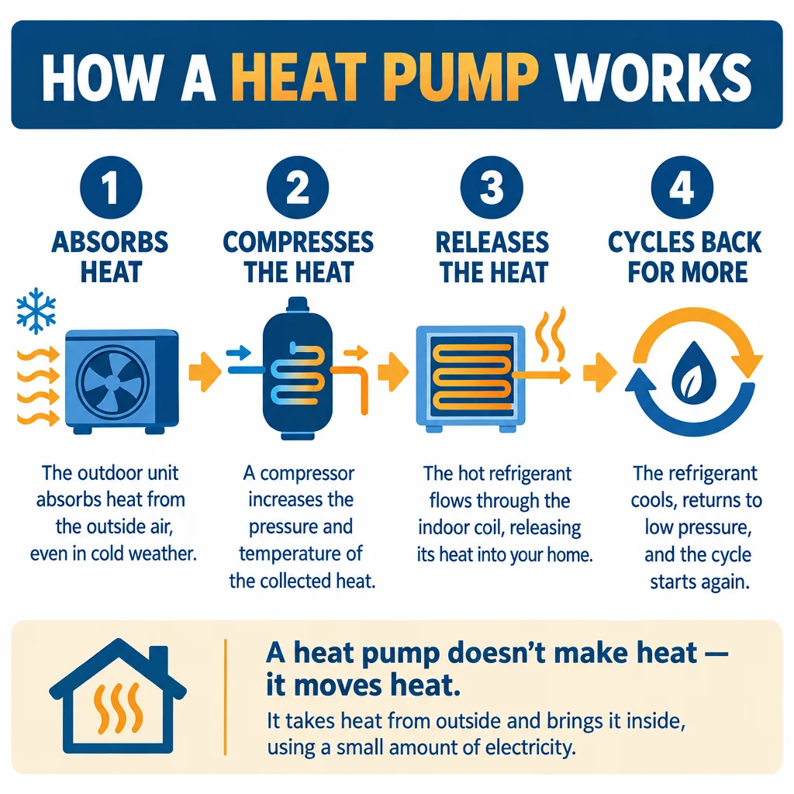

<!-- Built from data/prompts.json and locales/en.json by `node scripts/build.mjs`.
     Edit the source, not this file; `--check` fails CI on a hand edit. -->

# GPT Image 2.5 infographic and diagram prompts

Charts, timelines, exploded views and explainer slides. The long ones read almost like a spec: how many callouts, on which side, with what label text. That is the reason they work, and the reason many of them are written as JSON.

<p align="center"></p>

**[Open the 17 prompts](https://youart.ai/gpt-image-2-5-prompts?utm_source=github&utm_medium=category&utm_campaign=awesome-gpt-image-2-5-prompts&utm_content=infographic#infographic)**

[Awesome GPT Image 2.5 Prompts](../README.md) · [Browse by use case](../README.md#browse) · [How to write a GPT Image 2.5 prompt](../README.md#guide)

GPT, GPT Image and ChatGPT are trademarks of OpenAI. YouArt is an independent platform and is not affiliated with or endorsed by OpenAI. GPT Image 2.5 is still rolling out and is not yet open to every account; when it opens, these prompts move across unchanged.

---

<a id="p-16-panel-dance-pose-reference-sheet"></a>

## 16-Panel Dance Pose Reference Sheet

[@ExquisitMe](https://x.com/ExquisitMe) · [x.com](https://x.com/ExquisitMe/status/2048143577264402629) · [`evolink`](https://github.com/EvoLinkAI/awesome-gpt-image-2-API-and-Prompts/tree/e2a269ad1a055a0b4f6c1e170341c6c1aba30faa)

```json
{"type":"dance pose reference sheet","style":"clean studio pose chart, photoreal fitness-dance reference, white seamless background, sharp full-body photography, soft even lighting, minimal shadows, thin black grid lines separating panels","subject":{"count":1,"person":{"gender_presentation":"female","age_appearance":"young adult","build":"slim athletic toned dancer","skin_tone":"light tan","hair":{"color":"{argument name=\"hair color\" default=\"dark brown\"}","style":"high ponytail with loose strands"},"outfit":{"count":3,"items":["white fitted sports bra or cropped athletic tank","baggy blue-gray jogger pants","white sneakers"]}}},"layout":{"rows":4,"columns":4,"total_panels":16,"numbering":"black panel numbers in the top-left corner of each cell, labeled 1 through 16","sections":[{"title":"pose grid","position":"full page","count":16,"labels":["1","2","3","4","5","6","7","8","9","10","11","12","13","14","15","16"]}]},"poses":{"count":16,"items":[{"panel":1,"description":"wide stance, knees bent, torso upright, right arm extended straight to the right in a pointing gesture, left arm bent near the body"},{"panel":2,"description":"deep low squat facing forward, feet wide apart, one hand lifted in front of the chest, the other resting near the thigh"},{"panel":3,"description":"low floor-supported pose, leaning back on one hand with hips low, one knee bent under the body, opposite arm stretched diagonally upward"},{"panel":4,"description":"standing on one leg with the other knee raised, one arm curved overhead, opposite arm extended to the right in a strong dance line"},{"panel":5,"description":"deep squat with legs wide, one hand on thigh and the other arm reaching straight upward"},{"panel":6,"description":"light upright pose with one knee lifted and both arms relaxed outward for balance"},{"panel":7,"description":"wide stance with both arms crossed tightly in front of the chest, feet planted apart"},{"panel":8,"description":"low crouch close to the floor, one hand braced on the ground, the other arm crossing the torso"},{"panel":9,"description":"dynamic side-leaning wide stance, one arm bent upward beside the head, opposite arm pointing strongly to the right"},{"panel":10,"description":"compact crouch with weight centered low, one elbow resting near a knee and head tilted slightly downward"},{"panel":11,"description":"deep side lunge with one leg extended long to the side, one hand on the floor and the other arm reaching straight up"},{"panel":12,"description":"upright wide-legged stance, one arm extended vertically overhead, the other hand relaxed near the hip"},{"panel":13,"description":"standing balance pose with one knee raised and both hands held low near the thighs"},{"panel":14,"description":"low horse stance with knees bent wide and forearms crossed in front of the chest"},{"panel":15,"description":"kneeling or very low crouched pose with one hand on the floor and the other resting on the raised knee"},{"panel":16,"description":"high side kick, balancing on one leg while the other leg extends horizontally, both arms bent in a guarded fighting pose"}]},"intent":"a {argument name=\"sheet purpose\" default=\"dance move sheet chart that can also be used for combat pose reference\"}, emphasizing silhouette variety, balance, rhythm, and dynamic athletic body lines","image_size":"landscape 16:9"}
```

[Open the generator](https://youart.ai/gpt-image-2-5-prompts?utm_source=github&utm_medium=prompt&utm_campaign=awesome-gpt-image-2-5-prompts&utm_content=16-panel-dance-pose-reference-sheet#16-panel-dance-pose-reference-sheet)

<a id="p-16-pose-dance-combat-reference-sheet"></a>

## 16-Pose Dance Combat Reference Sheet

[@ExquisitMe](https://x.com/ExquisitMe) · [x.com](https://x.com/ExquisitMe/status/2048143577264402629) · [`evolink`](https://github.com/EvoLinkAI/awesome-gpt-image-2-API-and-Prompts/tree/e2a269ad1a055a0b4f6c1e170341c6c1aba30faa)

```json
{"type":"pose reference sheet","subject":{"theme":"hip-hop dance and combat-ready movement chart","character":{"count":1,"gender_presentation":"female","age_appearance":"young adult","body_type":"fit athletic dancer","skin_tone":"light tan","hair":{"color":"black","style":"high ponytail with loose strands"},"outfit":{"count":5,"items":["white sports bra or cropped athletic top","baggy purple jogger pants","white chunky sneakers","purple wristbands or forearm bands on both arms","small hoop earrings"]}}},"style":{"image_type":"photorealistic studio pose sheet","lighting":"clean even studio lighting","background":"plain light gray to white seamless backdrop","camera":"full-body framing, straight-on view, consistent distance","rendering":"sharp realistic anatomy, dynamic motion, slight shadow under feet","face":"intentionally blurred or obscured"},"layout":{"grid":{"rows":4,"columns":4,"count":16},"numbering":{"count":16,"labels":["1","2","3","4","5","6","7","8","9","10","11","12","13","14","15","16"],"position":"top-left corner of each cell"},"cell_borders":"thin black divider lines between all panels"},"poses":{"count":16,"items":[{"label":"1","description":"wide low squat, knees bent outward, torso angled slightly left, both arms extended loosely in a defensive dance stance"},{"label":"2","description":"deep side lunge to the left, left arm pointing straight left, right hand near the head, energetic directional pose"},{"label":"3","description":"low crouch with one hand touching the floor, one knee bent under the body, opposite arm extended horizontally"},{"label":"4","description":"upright one-leg balance, left knee lifted high, both arms spread outward for rhythm and balance"},{"label":"5","description":"similar one-leg raised pose with the other leg supporting, arms stretched outward in a lighter dance variation"},{"label":"6","description":"very wide grounded squat, torso pitched forward, one hand reaching toward the floor between the legs, other arm extended back"},{"label":"7","description":"dramatic standing back arch, chest lifted upward, hips forward, both arms opened behind and to the sides"},{"label":"8","description":"small jump or suspended squat, both feet off the floor, knees bent, arms spread wide symmetrically"},{"label":"9","description":"floor-supported seated lean, one hand planted behind, one arm reaching diagonally upward, legs bent to one side"},{"label":"10","description":"front-facing balance with one knee raised to hip height, one arm bent in guard position and the other extended sideways"},{"label":"11","description":"deep lateral stance, feet far apart, knees bent, both hands raised open near shoulder level like a ready combat pose"},{"label":"12","description":"low side lunge split, one hand planted on the floor, the other arm reaching vertically overhead, torso arched upward"},{"label":"13","description":"standing backward lean with relaxed bent knees, chest up, arms hanging loosely behind in a groove pose"},{"label":"14","description":"compact twisting crouch, weight low over bent legs, torso rotated, one arm pulled in and the other extended outward"},{"label":"15","description":"very wide side lunge stretch, one hand to the floor near the front foot, opposite arm reaching diagonally overhead"},{"label":"16","description":"one-leg lifted pose with knee high, one hand behind the head and the other arm extended forward, confident finishing stance"}]},"composition":"show the same dancer in all 16 panels with consistent outfit and scale, centered within each frame, designed like a movement library or choreography reference chart"}
```

[Open the generator](https://youart.ai/gpt-image-2-5-prompts?utm_source=github&utm_medium=prompt&utm_campaign=awesome-gpt-image-2-5-prompts&utm_content=16-pose-dance-combat-reference-sheet#16-pose-dance-combat-reference-sheet)

<a id="p-16-pose-dance-reference-sheet"></a>

## 16-Pose Dance Reference Sheet

[@ExquisitMe](https://x.com/ExquisitMe) · [x.com](https://x.com/ExquisitMe/status/2048143577264402629) · [`evolink`](https://github.com/EvoLinkAI/awesome-gpt-image-2-API-and-Prompts/tree/e2a269ad1a055a0b4f6c1e170341c6c1aba30faa)

```json
{"type":"pose reference sheet","subject":{"category":"female dancer fitness model","age_appearance":"young adult","build":"slim athletic","hair":{"color":"dark brown","style":"high ponytail"},"outfit":{"top":"light gray or white sports bra crop top","bottom":"baggy light gray sweatpants","shoes":"white sneakers"},"face":"softly blurred or de-emphasized facial features"},"style":{"image_type":"studio dance pose chart","background":"clean seamless white background","lighting":"bright even studio lighting with minimal shadows","color_palette":"neutral whites and light grays","camera":"full-body framing, straight-on view, consistent distance","rendering":"photorealistic"},"layout":{"grid":{"rows":4,"columns":4,"count":16,"border":"thin black dividers between cells"},"numbering":{"count":16,"labels":["1","2","3","4","5","6","7","8","9","10","11","12","13","14","15","16"],"position":"top-left corner of each panel"},"sections":[{"title":"row 1","position":"top","count":4,"labels":["1 side lunge with one arm extended straight sideways and the other bent near chest","2 low floor pose leaning on one hand with one knee down and opposite arm arched upward","3 wide squat facing front with both arms opened in angular dance position","4 standing balance on one leg with opposite knee lifted and forearms crossed near chest"]},{"title":"row 2","position":"upper-middle","count":4,"labels":["5 deep backbend in wide stance with torso arched and one arm curved overhead","6 wide squat with one hand behind head and the other arm pointing outward","7 kneeling side stretch with one hand on floor and opposite arm reaching straight up","8 standing arabesque-style extension with torso tilted forward and one leg lifted high behind/sideways"]},{"title":"row 3","position":"lower-middle","count":4,"labels":["9 wide squat with torso tilted left, one arm curved overhead and one arm extended low","10 front-facing wide squat with both arms stretched diagonally in opposite directions","11 relaxed standing pose with legs apart and both forearms crossing in front of torso","12 floor recline supported on one hand and one knee, torso leaning back with bent legs"]},{"title":"row 4","position":"bottom","count":4,"labels":["13 small jump or lifted balance with one knee raised and one arm bent upward","14 low crouch squat with one hand reaching toward floor and other arm extended sideways","15 dramatic side backbend in wide stance with hair swinging and one arm curved overhead","16 powerful wide squat with one hand at chest and the other lowered to the side"]}],"overall_composition":"all 16 poses shown as separate panels in a uniform contact sheet"},"prompt":"Create a clean studio contact sheet of {argument name=\"pose count\" default=\"16\"} full-body dance or combat-reference poses featuring a {argument name=\"subject type\" default=\"young athletic woman\"} in a {argument name=\"outfit\" default=\"light gray sports bra, loose gray sweatpants, and white sneakers\"}. Use a seamless {argument name=\"background color\" default=\"white\"} background, bright even lighting, and a consistent straight-on camera. Arrange the poses in a 4x4 grid with thin black panel lines and small black numbers 1 through 16 in the top-left of each cell. The poses should mix standing, squatting, kneeling, floorwork, balance, kick-extension, backbend, and angular arm positions suitable for a dance sheet chart or combat movement reference. Keep the styling photorealistic, crisp, minimal, and instructional, with consistent wardrobe and hair across all panels."}
```

[Open the generator](https://youart.ai/gpt-image-2-5-prompts?utm_source=github&utm_medium=prompt&utm_campaign=awesome-gpt-image-2-5-prompts&utm_content=16-pose-dance-reference-sheet#16-pose-dance-reference-sheet)

<a id="p-18-panel-mascot-brand-identity-document"></a>

## 18-Panel Mascot Brand Identity Document

[@Colin\_Leeee](https://x.com/Colin_Leeee) · [x.com](https://x.com/Colin_Leeee/status/2044802802149650631) · [`evolink`](https://github.com/EvoLinkAI/awesome-gpt-image-2-API-and-Prompts/tree/e2a269ad1a055a0b4f6c1e170341c6c1aba30faa)

```json
{
  "type": "18-panel brand identity and character design document",
  "brand": {
    "name": "{argument name=\"brand name\" default=\"沐阳 MUYANG TEA\"}",
    "industry": "{argument name=\"industry\" default=\"tea shop\"}",
    "colors": ["{argument name=\"primary color\" default=\"yellow\"}", "{argument name=\"secondary color\" default=\"green\"}", "white", "brown", "dark green"]
  },
  "subject": "{argument name=\"character description\" default=\"3D rendered cute Shiba Inu mascot wearing a green apron\"}",
  "layout": {
    "grid": "3 columns by 6 rows",
    "sections": [
      {
        "title": "01 品牌DNA分析 / BRAND DNA ANALYSIS",
        "elements": ["logo", "5 color swatches", "6 icons", "target audience charts"]
      },
      {
        "title": "02 概念构思 / CONCEPT MOODBOARD",
        "elements": ["5 photo references", "4 mood icons", "design equation"]
      },
      {
        "title": "03 形态研究 / FORM STUDY",
        "elements": ["4 logo anatomy icons", "4 evolution steps", "4 silhouettes"]
      },
      {
        "title": "04 概念探索 / CONCEPT EXPLORATION",
        "elements": ["12 line-art character sketches"]
      },
      {
        "title": "05 精细线稿 / REFINED LINE ART",
        "elements": ["3 rows of front and side line art with proportion guides"]
      },
      {
        "title": "06 细节精修 / DETAIL REFINEMENT",
        "elements": ["2 full-body renders with labels", "4 circular close-ups"]
      },
      {
        "title": "07 表情设定 / EXPRESSION SHEET",
        "elements": ["11 3D rendered head expressions"]
      },
      {
        "title": "08 姿势库 / POSE LIBRARY",
        "elements": ["9 full-body 3D rendered poses"]
      },
      {
        "title": "09 转身视图 / TURNAROUND VIEW",
        "elements": ["5 full-body 3D renders", "5 matching line-art views"]
      },
      {
        "title": "10 色彩开发 / COLOR DEVELOPMENT",
        "elements": ["5 rows of 5-color palettes", "color psychology text"]
      },
      {
        "title": "11 材质规格 / MATERIAL SPECIFICATION",
        "elements": ["5 texture swatches", "property sliders", "4 manufacturing icons"]
      },
      {
        "title": "12 色彩应用 / COLOR APPLICATION",
        "elements": ["4 color variant renders", "2 light/dark renders", "4 contrast rating circles"]
      },
      {
        "title": "13 构造指南 / CONSTRUCTION GUIDE",
        "elements": ["2 line-art diagrams for geometry and grid"]
      },
      {
        "title": "14 设计系统规则 / DESIGN SYSTEM RULES",
        "elements": ["minimum size icons", "clear space diagram", "4 usage examples"]
      },
      {
        "title": "15 资产变体 / ASSET VARIANTS",
        "elements": ["3 size variants", "3 line-art variants", "3 simplified flat heads"]
      },
      {
        "title": "16 数字应用 / DIGITAL APPLICATIONS",
        "elements": ["1 app icon", "2 social avatars", "UI elements", "3-step animation cycle"]
      },
      {
        "title": "17 实物应用 / PHYSICAL APPLICATIONS",
        "elements": ["plush toy mockup", "packaging mockup", "merchandise mockup", "storefront mockup"]
      },
      {
        "title": "18 最终主视觉 / FINAL RENDERING",
        "elements": ["large high-res 3D render of mascot holding tea", "logo", "file format list"]
      }
    ]
  }
}
```

[Open the generator](https://youart.ai/gpt-image-2-5-prompts?utm_source=github&utm_medium=prompt&utm_campaign=awesome-gpt-image-2-5-prompts&utm_content=18-panel-mascot-brand-identity-document#18-panel-mascot-brand-identity-document)

<a id="p-air-sign-zodiac-character-poster"></a>

## Air Sign Zodiac Character Poster

[@komorimedia](https://x.com/komorimedia) · [x.com](https://x.com/komorimedia/status/2048114825398731143) · [`evolink`](https://github.com/EvoLinkAI/awesome-gpt-image-2-API-and-Prompts/tree/e2a269ad1a055a0b4f6c1e170341c6c1aba30faa)

```json
{"type":"Chinese zodiac-themed character infographic poster","format":"vertical poster","aspect_ratio":"3:4","style":"clean pastel editorial infographic with anime-inspired fashion photography, soft magical accents, elegant horoscope design, premium magazine layout","background":{"color":"warm ivory","border":"thin decorative gold frame with small ornamental corners and tiny sparkles","top_right_motif":"large pale air-element swirl ornament"},"title_block":{"headline":"十二星座角色清單|風象星座","subheadline":"靈活・交流・思辨","alignment":"top center","headline_color":"deep desaturated blue","subheadline_color":"muted gold"},"subject":{"count":3,"description":"the same young East Asian woman used as the base character appears in 3 separate horoscope panels, each shown from about thigh-up to waist-up with long dark hair and soft feminine styling, photographed frontally and integrated into illustrated pastel zodiac backdrops"},"layout":{"sections":[{"title":"雙子座 Gemini","position":"top panel","count":1,"theme_color":"butter yellow and cream","zodiac_symbol":"Gemini glyph inside a circle on the left","constellation":"small Gemini constellation in the upper right","character_pose":"playful double peace signs raised beside her face","outfit":"pale yellow cardigan over a white ribbed crop top, light bottoms, yellow belt, delicate necklace","background_motifs_count":4,"background_motifs":["speech bubble icon","sparkles","curved flowing lines","soft dots"],"text_items_count":6,"text_items":["元素:風","概念:資訊玩家,靈感跳接","性格:機靈、善聊、多變","行動原則:先交流,再快速轉向","戀愛傾向:喜歡有趣互動與腦力火花","人際怪癖:話題切換速度快到像開分頁"]},{"title":"天秤座 Libra","position":"middle panel","count":1,"theme_color":"blush pink and pastel lavender","zodiac_symbol":"Libra glyph inside a circle on the left","constellation":"small Libra constellation in the upper right","character_pose":"one hand raised open-palmed as if presenting balance, the other hand near her chin in an elegant thoughtful pose","outfit":"pink blazer draped over shoulders, pastel pink-and-blue wrapped dress, jeweled belt, earrings, necklace, bracelet","background_motifs_count":4,"background_motifs":["scales illustration","flowing ribbon-like swirls","sparkles","soft gradient haze"],"text_items_count":6,"text_items":["元素:風","概念:關係設計師,追求平衡","性格:優雅、圓融、審美強","行動原則:先衡量,再找最順解法","戀愛傾向:重氛圍與互相體面","人際怪癖:選太久,但又很會照顧場面"]},{"title":"水瓶座 Aquarius","position":"bottom panel","count":1,"theme_color":"lavender, icy blue, and silver","zodiac_symbol":"Aquarius glyph inside a circle on the left","constellation":"small Aquarius constellation in the upper right","character_pose":"holding and tilting a futuristic transparent vessel as glowing water-like energy pours out in looping streams","outfit":"metallic silver crop top and skirt set with translucent iridescent jacket, futuristic straps, reflective accessories","background_motifs_count":4,"background_motifs":["glowing circular energy rings","constellation lines","sparkles","light trails"],"text_items_count":6,"text_items":["元素:風","概念:未來觀察員,規則改革者","性格:獨立、理想派、腦洞大","行動原則:先思考原理,再另闢路線","戀愛傾向:重精神共鳴,也需要個人空間","人際怪癖:忽冷忽熱,其實是在充電"]}],"panel_count":3},"typography":{"languages":["Traditional Chinese","English zodiac names"],"headline_font":"elegant high-contrast serif","body_font":"clean legible Chinese serif or sans-serif hybrid","zodiac_english":"italic calligraphic serif"},"visual_rules":{"each_panel_has":8,"panel_elements":["left zodiac glyph badge","center-left character","right text block","English zodiac name","small constellation","pastel illustrated background motifs","thin panel border","6 bullet-style info lines with icons"],"spacing":"generous margins and symmetrical alignment","render_quality":"high resolution, crisp print-ready infographic"}}
```

[Open the generator](https://youart.ai/gpt-image-2-5-prompts?utm_source=github&utm_medium=prompt&utm_campaign=awesome-gpt-image-2-5-prompts&utm_content=air-sign-zodiac-character-poster#air-sign-zodiac-character-poster)

<a id="p-alishan-one-day-travel-poster"></a>

## Alishan One-Day Travel Poster

[@TWnese](https://x.com/TWnese) · [x.com](https://x.com/TWnese/status/2048077204786212887) · [`evolink`](https://github.com/EvoLinkAI/awesome-gpt-image-2-API-and-Prompts/tree/e2a269ad1a055a0b4f6c1e170341c6c1aba30faa)

```text
Create a vintage illustrated travel poster in traditional Chinese for {argument name="destination name" default="阿里山國家風景區"}, designed as a one-day itinerary infographic with a split vertical layout. The left panel is a parchment-textured itinerary card in warm beige with ornate gold Art Nouveau borders and dark brown typography, and the right panel is a dramatic painted fantasy-realism map scene of a mountain journey at sunrise and sunset tones. At the top of the left panel, large headline text reads {argument name="headline text" default="阿里山國家風景區一日遊"}. Beneath it, include a short centered tagline in traditional Chinese: 「一座高山,五個經典景點。難忘的奇幻旅程。」 with a small decorative mountain divider. The left panel must contain exactly 5 numbered itinerary stops stacked vertically, each with a circular black-and-gold number badge, a small vignette illustration, a bold location name, a time in parentheses, and a short Chinese description. The 5 stops are: 1. 「阿里山車站」 at 「(8:00 AM)」 with a wooden mountain railway station illustration and description 「開啟探索神木與森林的旅程。」 2. 「阿里山森林鐵路」 at 「(9:30 AM)」 with a red-and-black steam train illustration and description 「穿越森林,體驗百年林鐵風情。」 3. 「神木區棧道」 at 「(11:30 AM)」 with giant cedar trees and elevated wooden boardwalk illustration and description 「漫步千年巨木下,感受森林靈氣。」 4. 「姊妹潭」 at 「(1:30 PM)」 with a tranquil forest lake and pavilion illustration and description 「欣賞靜謐湖光,聆聽自然樂章。」 5. 「小笠原山展望台」 at 「(4:00 PM)」 with a wooden observation deck above clouds at sunset illustration and description 「觀賞壯闊山景與雲海,欣賞日落。」 The right panel should depict a continuous glowing golden path winding through exactly 5 numbered map markers that match the left panel labels in order, with black-and-gold marker plaques reading: 1 「阿里山車站」, 2 「阿里山森林鐵路」, 3 「神木區棧道」, 4 「姊妹潭」, 5 「小笠原山展望台」. Show stop 1 as a rustic alpine wooden station perched on a cliff among pine forests; stop 2 as a small steam locomotive traveling on a curved mountain railway with smoke drifting upward; stop 3 as towering ancient red cypress trees with a spiral and zigzag wooden walkway around the trunks; stop 4 as an emerald lake surrounded by dense forest with a small pavilion and arched bridge; stop 5 as a lookout deck on a peak above a sea of clouds, facing a glowing sunset. The environment should feature layered mountain ranges, mist-filled valleys, evergreen forests, golden-hour light, luminous cloud seas, and a romantic painterly atmosphere with rich detail. At the bottom right, add a decorative compass rose labeled N, E, S, W, plus a dark green and gold information box with exactly 2 stats in traditional Chinese: 「總距離 ~9公里 / 5.6英里」 and 「預計時間 全天 - 14,500步」. Overall style: premium tourism poster, painterly digital illustration, nostalgic national-park brochure aesthetic, highly detailed, warm sepia and gold accents, elegant composition, readable Chinese text, vertical 2:3 poster.
```

[Open the generator](https://youart.ai/gpt-image-2-5-prompts?utm_source=github&utm_medium=prompt&utm_campaign=awesome-gpt-image-2-5-prompts&utm_content=alishan-one-day-travel-poster#alishan-one-day-travel-poster)

<a id="p-infographic-edu-visual-editable-ppt-workflow-infographic"></a>

## Infographic / Edu Visual - Editable PPT Workflow Infographic

[@NFT\_Chen](https://x.com/NFT_Chen) · [x.com](https://x.com/NFT_Chen/status/2096887500300296416) · [`youmind`](https://github.com/YouMind-OpenLab/awesome-gpt-image-2/tree/415720754e9e767306922fc20b9953ec7830e5cf)

```text
Goal: Create a dark futuristic Chinese workflow infographic slide showing how to turn written content plus images into an advanced editable PPT, with a premium tech presentation aesthetic.

Canvas: Wide 16:9 horizontal slide, deep navy/black background with subtle circuit-line texture, thin glowing border, cyan and gold neon accents, soft bloom highlights, clean corporate SaaS style.

Main headline: Centered at the top, use {argument name="headline text" default="文稿 + 配图 → 高级可编辑PPT"}. Highlight “文稿” in gold, “配图” in cyan, and the rest in white. Add a small cyan lens flare under the headline.

Top workflow layout: Place exactly 3 large rounded rectangular cards across the upper half, connected by a glowing horizontal process line and arrows that run left to right.
1. Card 1: Yellow numbered circle “1”, title “ChatGPT”, subtitle “理清文字结构”, large gold chat-bubble icon with three dots.
2. Card 2: Cyan numbered circle “2”, title “Image2”, subtitle “生成整页视觉稿”, small mock visual preview containing exactly 3 inner panels: a landscape image, a mini bar-chart/text panel, and a second landscape image.
3. Card 3: Yellow numbered circle “3”, title “GPT-6”, subtitle “拆层成可编辑PPT”, layered floating blue sheets over a gold base icon.

Central demonstration: In the lower middle-left, create one large tilted PPT slide mockup with rounded corners and glow. Slide title text: {argument name="demo slide title" default="未来城市：智能与可持续的融合"}. Slide subtitle: {argument name="demo slide subtitle" default="技术创新 · 绿色发展 · 生态共生"}. Inside the slide, show a cinematic mountain lake landscape at sunset, plus a small inset city skyline image on the right.

Metric row inside the slide: Show exactly 3 metric items along the bottom of the slide: “35% 能源效率提升” with a clipboard icon in cyan, “60% 碳排放降低” with a shield/check icon in gold, and “2026 全面落地目标” with a globe icon in gold.

Layer conversion effect: To the right of the central slide, show the slide splitting into multiple translucent editable layers, about 7 visible stacked panels, with flowing cyan and gold data particles moving from the slide into the layers.

Editable output list: On the right side, create exactly 4 stacked rounded cards connected by thin lines to the separated layers:
1. “标题文本” with smaller text “副标题文本”, icon: large letter T.
2. “流程图节点” with smaller text “可编辑 · 可调整”, icon: flowchart nodes.
3. “图片占位符” with smaller text “替换 · 缩放 · 裁剪”, icon: image placeholder.
4. “布局与样式” with smaller text “母版 · 主题 · 动画”, icon: layout grid.

Bottom slogan: Centered near the bottom, in gold Chinese characters with dot separators, use {argument name="bottom slogan" default="好看 · 能改 · 复用"}.

Visual style: High-resolution presentation infographic, crisp vector-like UI, luminous cyan and warm gold strokes, glassmorphism cards, subtle depth and perspective, modern Chinese typography, clean spacing, no people, no logos, no watermark. Keep all listed text legible and preserve the exact counts: 3 top workflow cards, 3 metric items, 4 editable-output cards, and 7 visible separated layer panels.
```

[Open the generator](https://youart.ai/gpt-image-2-5-prompts?utm_source=github&utm_medium=prompt&utm_campaign=awesome-gpt-image-2-5-prompts&utm_content=infographic-edu-visual-editable-ppt-workflow-infographic#infographic-edu-visual-editable-ppt-workflow-infographic)

<a id="p-infographic-edu-visual-graphite-portrait-drawing-progression"></a>

## Infographic / Edu Visual - Graphite Portrait Drawing Progression

[@HaniaAi12](https://x.com/HaniaAi12) · [x.com](https://x.com/HaniaAi12/status/2097126331222040764) · [`youmind`](https://github.com/YouMind-OpenLab/awesome-gpt-image-2/tree/415720754e9e767306922fc20b9953ec7830e5cf)

```text
Goal: Create a 3 by 3 progression sheet showing the development of a realistic graphite pencil portrait from a faint construction sketch to a polished finished drawing.

Canvas: Vertical portrait canvas on clean white drawing paper, arranged as exactly 9 equal panels in a 3-column by 3-row grid with subtle panel boundaries and consistent spacing. Use monochrome graphite only, no color.

Subject details: The same young woman appears in every panel, facing forward in a centered bust portrait. She has an oval face, soft youthful features, large almond-shaped eyes, defined arched brows, a small straight nose, full lips with a slight closed-mouth smile, and a calm elegant expression. Her {argument name="hair color" default="dark graphite-shaded hair"} is styled in a voluminous loose updo with wispy curled tendrils framing both sides of her face. She wears dangling jeweled earrings on both ears and an off-shoulder dark dress with a wide neckline exposing the shoulders and collarbones.

Progression layout: Show exactly 9 portrait stages. Panel 1: very pale initial oval head and shoulder construction, blank face with vertical and horizontal guideline cross, loose hair and neckline outlines. Panel 2: light line drawing with facial features added, eyes, brows, nose, lips, earrings, hair outline, and shoulders lightly indicated. Panel 3: early shading with more complete face, hair texture, earrings, collarbones, and darkened neckline. Panel 4: mid-level graphite rendering with clearer facial shadows, detailed eyes and lips, more hair volume, earrings, and dress shading. Panel 5: stronger contrast and smoother realistic shading across face, hair, neck, shoulders, and dress. Panel 6: nearly finished portrait with darker hair, refined eyes, lips, earrings, neckline, and balanced soft skin shading. Panel 7: polished realistic drawing with rich graphite values, sharp facial detail, darker dress, and soft paper texture. Panel 8: finished refined version, high realism, smooth tonal gradients, crisp features, voluminous hair, subtle collarbone shading. Panel 9: final finished portrait, cleanest and most balanced, strong dark hair and dress contrast, delicate highlights in eyes and lips, elegant earrings, and natural graphite texture.

Visual style: Extremely realistic traditional graphite pencil sketch, visible pencil strokes, soft smudged shading, layered crosshatching in darker areas, clean white background, delicate handmade drawing-paper feel. Maintain the same pose, proportions, clothing, hairstyle, jewelry, and expression across all 9 panels while only increasing completion and contrast from left to right and top to bottom.

Constraints: No text, no labels, no watermark, no color, no digital painting effects, no extra subjects, and do not change the woman’s identity between panels.
```

[Open the generator](https://youart.ai/gpt-image-2-5-prompts?utm_source=github&utm_medium=prompt&utm_campaign=awesome-gpt-image-2-5-prompts&utm_content=infographic-edu-visual-graphite-portrait-drawing-progression#infographic-edu-visual-graphite-portrait-drawing-progression)

<a id="p-japanese-sci-fi-suit-up-process-board"></a>

## Japanese Sci-Fi Suit-Up Process Board

[@yy7482933910896](https://x.com/yy7482933910896) · [x.com](https://x.com/yy7482933910896/status/2048192904922075161) · [`evolink`](https://github.com/EvoLinkAI/awesome-gpt-image-2-API-and-Prompts/tree/e2a269ad1a055a0b4f6c1e170341c6c1aba30faa)

```json
{"type":"Japanese sci-fi armor dressing-process infographic","style":"cinematic live-action tokusatsu-inspired promotional board, realistic industrial lighting, polished metal surfaces, sharp photographic detail","theme":"manual pre-battle suit-up sequence for a female hero in a red, silver, black, and blue protector suit","subject":{"character":{"gender":"female","age":"young adult","identity":"helmetless heroine during assembly, face intentionally obscured or anonymized in every unhelmeted panel","hair":"dark brown to black hair tied in a high ponytail with bangs","undersuit":"glossy black skintight inner suit with silver chest panel and white neck ring","armor":"retro-futuristic protector armor with red shoulder and arm plates, silver breastplate and torso plating, circular blue chest core, red waist unit, white gloves, red forearm guards with yellow stripe accents","helmet":"round red-and-silver helmet with black visor"},"environment":{"location":"high-tech industrial hangar or armor bay","background elements":["metal framework","robotic equipment","tool benches","armor racks","computer monitors","workshop lighting","bay corridor marked BAY-07 in final panel"]}},"layout":{"header":{"count":2,"labels":["ソルジャンヌ・スーツ 手動装着プロセス","専用プロテクタースーツ『ソルジャンヌ』を、戦闘前に手動で装着する様子。各ユニットを確実に装着し、システムを起動する。"],"design":"wide black-to-red gradient banner across top, large bold white Japanese text, diagonal red accent"},"sections":[{"title":"1 インナースーツの確認","position":"top-left","count":1,"labels":["各部のセンサーとコネクタをチェック。戦闘に備え、身体の状態を最終認する。"],"image":"three-quarter view of the heroine in only the black glossy inner suit, looking down while checking or tightening a wrist connector"},{"title":"2 胸部・肩部アーマーの装着","position":"top-center","count":1,"labels":["胸部ユニットと肩部プロテクターを装着。コネクタを接続し、ロックを固定する。"],"image":"mid shot with chest armor and red shoulder plates installed, heroine fastening the front torso area with both hands"},{"title":"3 腰部ユニット・ベルトの固定","position":"top-right","count":1,"labels":["ウエストユニットを装着し、各部のロックを確認。可動部の動作チェックを行う。"],"image":"mid shot with torso armor completed, heroine tightening or checking the waist belt and side locks"},{"title":"4 ヘルメットの準備","position":"bottom-left","count":1,"labels":["ヘルメットのバイザーと内部システムをチェック。ヘッドセットとの同期を確認する。"],"image":"heroine holding the red helmet in both hands at chest height, showing the glossy black visor"},{"title":"5 ヘルメットの装着・システム起動","position":"bottom-center","count":1,"labels":["ヘルメットを装着し、直上のコネクタをロック。全身のシステムが起動し、胸部コアが発光する。"],"image":"heroine placing the helmet onto her head with both hands; blue chest core glowing brightly"},{"title":"6 装着完了","position":"bottom-right","count":1,"labels":["全システムの最終チェックを行い、戦闘モードへ。ソルジャンヌ、出撃準備完了!"],"image":"full-body frontal hero pose in a futuristic corridor, fully suited with helmet on, arms relaxed at sides"}],"footer":{"count":1,"labels":["一つ一つの装着が、命を守り、力を引き出す。 ソルジャンヌの戦いは、ここから始まる。"],"design":"dark red cinematic footer strip with centered white Japanese slogan"},"grid":{"rows":2,"columns":3,"panel_count":6,"panel_borders":"thin white dividers","number_badges":6}},"text_rendering":{"language":"Japanese","font":"bold sans-serif headline with smaller sans-serif body text","colors":"white text on black, red, and white info bars; red numbered squares with white numerals"},"composition":"16:9 wide infographic board, six equal photo panels arranged in a 3-by-2 grid, each panel captioned below with a red numbered box from 1 to 6","lighting":"moody workshop lighting with metallic reflections and red accent lights, realistic shadows, cinematic sci-fi atmosphere"}
```

[Open the generator](https://youart.ai/gpt-image-2-5-prompts?utm_source=github&utm_medium=prompt&utm_campaign=awesome-gpt-image-2-5-prompts&utm_content=japanese-sci-fi-suit-up-process-board#japanese-sci-fi-suit-up-process-board)

<a id="p-landscape-architecture-board"></a>

## Landscape Architecture Board

[@iamaiistudio](https://x.com/iamaiistudio) · [x.com](https://x.com/iamaiistudio/status/2054654236705845670) · [`evolink`](https://github.com/EvoLinkAI/awesome-gpt-image-2-API-and-Prompts/tree/e2a269ad1a055a0b4f6c1e170341c6c1aba30faa)

```text
Generate a 3:4 vertical, competition-grade landscape architecture presentation board. The board blends photorealistic aerial rendering with refined architectural diagram language, in the style of a high-end international landscape competition submission. Mood: calm, atmospheric, regenerative, ecological, scientific yet poetic. Layout (three stacked zones): 1. Top zone: analytical ecological diagrams and mapping overlays. 2. Middle zone: a large aerial landscape rendering as the primary focal image. 3. Bottom zone: a continuous sectional cut through the ecological landscape system. Top analytical zone: • Simplified ecological maps with soft, transparent color overlays. • Ultra-thin linework in white and pale gray. • Diagrams of water flow, circulation systems, ecological networks, habitat zones, and landscape connectivity. • Dashed lines for movement and flow. • Minimal annotations and soft ecological icons. • Floating overlay effect sitting above the rendering. • Very light pastel tones, high transparency, clean spacing, no dense clutter. Middle aerial rendering: • Bird's-eye view of an ecological restoration landscape. • Wetlands, ponds, flowing water systems, vegetation patches, bioswales, regenerative terrain. • Soft, slightly desaturated palette of greens, browns, and muted water blues. • Atmospheric depth with subtle haze in the distance. • Gentle human and ecological activity: walking paths, birds, small environmental interactions. • Wide landscape depth, smooth terrain transitions, calm cinematic environmental lighting. • Soft paper-texture finish integrated into the rendering. Bottom sectional cut: • Continuous section through terrain and ecological systems. • Soil layers, hydrology, groundwater movement, vegetation roots, ecological restoration processes, water filtration systems. • Thin white or pale linework, muted tones, minimal color. • Arrows indicating water movement and ecological flow. • Elegant architectural drafting quality, seamlessly merged into the board. Diagram language: extremely thin and precise linework, slightly softened edges (no harsh vector look), minimal labels, clean scientific notation, soft ecological symbols, balanced between scientific clarity and poetic visualization. Color system: • Base: desaturated greens, earthy browns, muted blue water tones. • Overlay: pale green, soft cyan, light beige, translucent pastel layers. • Avoid saturated accents, harsh contrast, bright reds, or overly graphic colors. Texture and atmosphere: soft atmospheric rendering, slight environmental haze, diffused lighting, subtle paper-grain or printed board texture, refined competition-board aesthetic. Format: 3:4 vertical architectural competition board composition. #AIart #GPTImage2
```

[Open the generator](https://youart.ai/gpt-image-2-5-prompts?utm_source=github&utm_medium=prompt&utm_campaign=awesome-gpt-image-2-5-prompts&utm_content=landscape-architecture-board#landscape-architecture-board)

<a id="p-male-glow-up-analysis-poster"></a>

## Male Glow-Up Analysis Poster

[@frametheory058](https://x.com/frametheory058) · [x.com](https://x.com/frametheory058/status/2056038533962555737) · [`evolink`](https://github.com/EvoLinkAI/awesome-gpt-image-2-API-and-Prompts/tree/e2a269ad1a055a0b4f6c1e170341c6c1aba30faa)

```text
I will upload a face photo/selfie.

Create an ULTRA PREMIUM AI MALE GLOW-UP ANALYSIS POSTER with a luxury fashion-tech aesthetic.

IMPORTANT:
The uploaded face and identity must remain EXACTLY THE SAME.

Do NOT change:
- facial structure
- eyes
- nose
- lips
- jawline
- skin tone
- facial proportions
- identity

The face should look 100% identical to the uploaded image.

You MAY enhance:
- hairstyle
- beard style
- expression
- outfit
- lighting
- posture
- styling
- background
- overall attractiveness

STYLE:
The final result should look like:
- a luxury grooming brand campaign
- a futuristic men’s fashion magazine
- a premium AI self-improvement dashboard
- cinematic and extremely expensive

NO basic infographic look.
NO cheap AI poster style.
NO cartoonish design.

THEME:
Use a premium modern luxury aesthetic:
- matte black
- champagne gold
- warm beige
- silver accents
- dark graphite
- soft cinematic lighting

Add:
- glassmorphism UI
- floating premium panels
- luxury typography
- subtle reflections
- realistic shadows
- elegant spacing
- premium composition

CENTER SUBJECT:
- Place the uploaded face in the center
- Make him look like a high-status modern male model
- Confident masculine expression
- Attractive but realistic
- Strong eye contact
- Natural skin texture

HAIRSTYLE SECTION:
Create premium hairstyle recommendations using the SAME FACE:
- textured quiff
- low taper
- side part flow
- modern messy hairstyle
- clean slick back

BEARD SECTION:
Using the SAME FACE:
- light stubble
- short boxed beard
- clean shave
- sharp jawline beard

OUTFIT STYLE SECTION:
Create multiple premium outfit inspirations using the SAME FACE:
- old money
- smart casual
- luxury streetwear
- classy formal
- monochrome black fit

All outfits should look:
- tailored
- masculine
- expensive
- editorial quality

FACE ANALYSIS SECTION:
Include:
- face shape
- jawline analysis
- facial harmony
- symmetry
- hairstyle compatibility
- skin undertone
- attractiveness strengths

COLOR PALETTE SECTION:
Show best clothing colors:
- black
- cream
- olive
- navy
- charcoal
- white

GLASSES SECTION:
Show glasses/sunglasses styles that suit the face:
- aviator
- rectangle
- wayfarer
- round metal

BEST ANGLES SECTION:
Create multiple mini portraits using the SAME FACE:
- 3/4 angle
- side profile
- eye-level
- slight down angle

BACKGROUND:
Luxury studio environment:
- blurred city lights
- elegant interior
- premium fashion studio
- cinematic depth
- luxury apartment vibe

TEXT STYLE:
Minimal, clean, elegant.
Looks like a premium fashion editorial mixed with AI analysis.

QUALITY:
- ultra realistic
- hyper detailed
- 8K
- cinematic realism
- luxury aesthetic
- highly polished
- visually addictive
```

[Open the generator](https://youart.ai/gpt-image-2-5-prompts?utm_source=github&utm_medium=prompt&utm_campaign=awesome-gpt-image-2-5-prompts&utm_content=male-glow-up-analysis-poster#male-glow-up-analysis-poster)

<a id="p-mascot-brand-identity-sheet"></a>

## Mascot Brand Identity Sheet

[@iamaiistudio](https://x.com/iamaiistudio) · [x.com](https://x.com/iamaiistudio/status/2066568983453880412) · [`evolink`](https://github.com/EvoLinkAI/awesome-gpt-image-2-API-and-Prompts/tree/e2a269ad1a055a0b4f6c1e170341c6c1aba30faa)

```json
{
  "type": "18-section complete brand identity and mascot design sheet",
  "brand": {
    "name": "{argument name=\"brand name\" default=\"MUYANG TEA\"}",
    "industry": "{argument name=\"industry\" default=\"tea shop\"}",
    "colors": ["{argument name=\"primary color\" default=\"yellow\"}", "{argument name=\"secondary color\" default=\"green\"}", "white", "brown", "dark green"]
  },
  "subject": "{argument name=\"character description\" default=\"3D rendered cute Shiba Inu mascot wearing a green apron\"}",
  "layout": {
    "grid": "3-column by 6-row grid layout",
    "sections": [
      {
        "title": "01 BRAND DNA ANALYSIS",
        "elements": ["brand logo", "5 color swatches", "6 brand icons", "target audience charts"]
      },
      {
        "title": "02 CONCEPT MOODBOARD",
        "elements": ["5 reference photos", "4 mood icons", "design concept equation"]
      },
      {
        "title": "03 FORM STUDY",
        "elements": ["4 logo anatomy icons", "4 design evolution steps", "4 character silhouettes"]
      },
      {
        "title": "04 CONCEPT EXPLORATION",
        "elements": ["12 line-art character concept sketches"]
      },
      {
        "title": "05 REFINED LINE ART",
        "elements": ["3 rows of front and side view line art with proportion guides"]
      },
      {
        "title": "06 DETAIL REFINEMENT",
        "elements": ["2 full-body renders with annotation labels", "4 circular close-up views"]
      },
      {
        "title": "07 EXPRESSION SHEET",
        "elements": ["11 3D rendered facial expressions"]
      },
      {
        "title": "08 POSE LIBRARY",
        "elements": ["9 full-body 3D rendered character poses"]
      },
      {
        "title": "09 TURNAROUND VIEW",
        "elements": ["5 full-body 3D renders from multiple angles", "5 matching line-art views"]
      },
      {
        "title": "10 COLOR DEVELOPMENT",
        "elements": ["5 rows of 5-color palette options", "color psychology explanations"]
      },
      {
        "title": "11 MATERIAL SPECIFICATION",
        "elements": ["5 surface texture swatches", "material property sliders", "4 manufacturing process icons"]
      },
      {
        "title": "12 COLOR APPLICATION",
        "elements": ["4 color scheme variant renders", "2 light and dark mode renders", "4 contrast rating indicators"]
      },
      {
        "title": "13 CONSTRUCTION GUIDE",
        "elements": ["2 line-art technical diagrams for geometry and grid system"]
      },
      {
        "title": "14 DESIGN SYSTEM RULES",
        "elements": ["minimum size icons", "clear space diagram", "4 correct and incorrect usage examples"]
      },
      {
        "title": "15 ASSET VARIANTS",
        "elements": ["3 scaled size variants", "3 line-art style variants", "3 simplified flat icon heads"]
      },
      {
        "title": "16 DIGITAL APPLICATIONS",
        "elements": ["1 app icon design", "2 social media avatar versions", "UI component elements", "3-frame animation cycle"]
      },
      {
        "title": "17 PHYSICAL APPLICATIONS",
        "elements": ["plush toy product mockup", "product packaging mockup", "branded merchandise mockup", "retail storefront mockup"]
      },
      {
        "title": "18 FINAL RENDERING",
        "elements": ["large high-resolution 3D mascot render holding tea cup", "finalized logo", "deliverable file format list"]
      }
    ]
  }
}
```

[Open the generator](https://youart.ai/gpt-image-2-5-prompts?utm_source=github&utm_medium=prompt&utm_campaign=awesome-gpt-image-2-5-prompts&utm_content=mascot-brand-identity-sheet#mascot-brand-identity-sheet)

<a id="p-parent-child-miscommunication-infographic"></a>

## Parent-Child Miscommunication Infographic

[@sarinaashapi](https://x.com/sarinaashapi) · [x.com](https://x.com/sarinaashapi/status/2048307780864606708) · [`evolink`](https://github.com/EvoLinkAI/awesome-gpt-image-2-API-and-Prompts/tree/e2a269ad1a055a0b4f6c1e170341c6c1aba30faa)

```json
{"type":"Japanese infographic","style":"simple, easy-to-understand flat vector diagram, clean white background, rounded light-gray outer frame, minimal pastel color palette, presentation-slide design, clear hierarchy, lots of whitespace, modern sans-serif Japanese typography","canvas":{"aspect_ratio":"16:9"},"headline":{"text":"{argument name=\"headline text\" default=\"親子のすれ違いは、記録があるかないかで起こる\"}","position":"top center","size":"large bold black"},"layout":{"structure":"2 side-by-side rounded panels beneath the headline","sections":[{"title":"記録がない場合(ズレる)","position":"left","count":8,"header_color":"muted blue-gray","panel_border":"light gray","labels":["親の記憶","子どもの記憶","あのとき決まったよね","まだ考えてたのに","ズレが大きくなる","志望校がコロコロ変わる","理由が『なんとなく』","言ってることが違う","関係がギクシャク","現実を見てほしい","ちゃんと決めてほしい","口を出しすぎると関係が悪くなる"],"contents":{"top_left":{"type":"parent icon with thought bubble","icon_color":"blue","caption":"親の記憶","bubble_text":"あのとき\n決まったよね"},"top_right":{"type":"child icon with thought bubble","icon_color":"pink","caption":"子どもの記憶","bubble_text":"まだ考えてたのに"},"center":{"type":"horizontal double-headed arrow","color":"blue-gray"},"bottom_center":{"type":"downward arrow leading to burst shape","color":"light gray","burst_text":"ズレが\n大きくなる"},"bottom_left":{"type":"rounded note box","bullet_count":4,"bullets":["志望校がコロコロ変わる","理由が『なんとなく』","言ってることが違う","関係がギクシャク"]},"bottom_right":{"type":"rounded note box","bullet_count":3,"bullets":["現実を見てほしい","ちゃんと決めてほしい","口を出しすぎると関係が悪くなる"]}}},{"title":"記録がある場合(ズレにくい)","position":"right","count":7,"header_color":"mustard yellow","panel_border":"light yellow","labels":["親の認識","子どもの認識","記録"],"contents":{"top_left":{"type":"parent icon with thought bubble containing document symbol","icon_color":"blue","caption":"親の認識"},"top_right":{"type":"child icon with thought bubble containing document symbol","icon_color":"pink","caption":"子どもの認識"},"center":{"type":"horizontal double-headed arrow","color":"mustard yellow"},"bottom_center":{"type":"circular record icon with document symbol","outline_color":"mustard yellow","text":"記録"},"bottom_left_connector":{"type":"curved arrow from parent to record","color":"blue"},"bottom_right_connector":{"type":"curved arrow from child to record","color":"pink"}}}],"spacing":"balanced, symmetrical"},"visual_language":{"icons":"generic human bust icons and simple document line icons","emphasis":"contrast the left panel's misunderstanding with the right panel's shared record","mood":"educational, calm, practical"},"text_language":"Japanese","render_quality":"crisp vector edges, infographic suitable for social media educational posts"}
```

[Open the generator](https://youart.ai/gpt-image-2-5-prompts?utm_source=github&utm_medium=prompt&utm_campaign=awesome-gpt-image-2-5-prompts&utm_content=parent-child-miscommunication-infographic#parent-child-miscommunication-infographic)

<a id="p-scandinavian-cookbook-recipe-spread"></a>

## Scandinavian Cookbook Recipe Spread

[@iamaiistudio](https://x.com/iamaiistudio) · [x.com](https://x.com/iamaiistudio/status/2069197657147638241) · [`evolink`](https://github.com/EvoLinkAI/awesome-gpt-image-2-API-and-Prompts/tree/e2a269ad1a055a0b4f6c1e170341c6c1aba30faa)

```json
{
  "style": "Clean minimalist recipe infographic",
  "visual_aesthetic": {
    "photography_style": "Top-down and 3-quarter angle food photography",
    "design_language": "Nordic editorial cookbook aesthetic",
    "background": "Warm beige / cream neutral",
    "lighting": "Soft diffused light with gentle shadows",
    "detail_level": "Photorealistic, ultra-sharp, 8K quality"
  },
  "layout": {
    "composition": "Hero dish centered on a white ceramic plate or bowl",
    "elements": [
      "Ingredient icons in soft rounded frames",
      "Minimal vector-style ingredient illustrations",
      "Ingredient labels with quantities",
      "Numbered step-by-step cooking flow with icons"
    ],
    "typography": "Modern sans-serif, high readability",
    "spacing": "Airy, balanced, uncluttered"
  },
  "recipes": [
    {
      "dish_name": "Traditional Polish Pierogi",
      "dish_presentation": "Golden boiled dumplings stuffed with potato and farmer cheese, finished with butter and fresh chives",
      "ingredients": [
        { "name": "All-purpose flour", "quantity": "2.5 cups" },
        { "name": "Potatoes", "quantity": "3 medium" },
        { "name": "Farmer cheese", "quantity": "200g" },
        { "name": "Onion", "quantity": "1 medium" },
        { "name": "Butter", "quantity": "40g" },
        { "name": "Salt", "quantity": "1 tsp" },
        { "name": "Water", "quantity": "0.75 cups" }
      ],
      "steps": [
        "Make the dough",
        "Cook and mash the filling",
        "Fill and fold pierogi",
        "Boil until tender",
        "Finish with butter"
      ],
      "meta": {
        "calories": "270 kcal / serving",
        "time": "70 min",
        "servings": 4
      }
    },
    {
      "dish_name": "Vinaigrette Salad",
      "dish_presentation": "Vibrant diced root vegetables tossed in a light dressing, shaped and garnished with fresh herbs",
      "ingredients": [
        { "name": "Beetroot", "quantity": "2 medium" },
        { "name": "Potatoes", "quantity": "2 medium" },
        { "name": "Carrots", "quantity": "1 medium" },
        { "name": "Pickled cucumbers", "quantity": "2 pcs" },
        { "name": "Green peas", "quantity": "1 cup" },
        { "name": "Sunflower oil", "quantity": "2 tbsp" },
        { "name": "Fresh dill", "quantity": "1 bunch" }
      ],
      "steps": [
        "Boil the vegetables",
        "Cool and dice",
        "Combine all ingredients",
        "Dress the salad",
        "Refrigerate and serve"
      ],
      "meta": {
        "calories": "180 kcal / serving",
        "time": "30 min + chill",
        "servings": 4
      }
    },
    {
      "dish_name": "Solyanka Soup",
      "dish_presentation": "Hearty soup loaded with sliced mixed meats, briny olives, lemon, and fresh herbs, served in a ceramic bowl",
      "ingredients": [
        { "name": "Mixed meats", "quantity": "400g" },
        { "name": "Onion", "quantity": "1 large" },
        { "name": "Pickles", "quantity": "3 pcs" },
        { "name": "Tomato paste", "quantity": "2 tbsp" },
        { "name": "Olives", "quantity": "0.5 cup" },
        { "name": "Garlic", "quantity": "2 cloves" },
        { "name": "Bay leaf", "quantity": "1 pc" },
        { "name": "Lemon", "quantity": "for serving" }
      ],
      "steps": [
        "Prepare the broth",
        "Saute aromatics",
        "Add meats and pickles",
        "Season and simmer",
        "Serve with lemon"
      ],
      "meta": {
        "calories": "320 kcal / serving",
        "time": "90 min",
        "servings": 5
      }
    }
  ]
}
```

[Open the generator](https://youart.ai/gpt-image-2-5-prompts?utm_source=github&utm_medium=prompt&utm_campaign=awesome-gpt-image-2-5-prompts&utm_content=scandinavian-cookbook-recipe-spread#scandinavian-cookbook-recipe-spread)

<a id="p-vintage-claude-shannon-infographic-poster"></a>

## Vintage Claude Shannon Infographic Poster

[@mob\_17](https://x.com/mob_17) · [x.com](https://x.com/mob_17/status/2048118645017219381) · [`evolink`](https://github.com/EvoLinkAI/awesome-gpt-image-2-API-and-Prompts/tree/e2a269ad1a055a0b4f6c1e170341c6c1aba30faa)

```json
{"type":"vintage editorial infographic poster","subject":"Claude Shannon and information theory","style":{"era":"1940s Bell Labs archival poster","look":"aged cream paper, blueprint drafting grid, thin ink linework, muted navy and charcoal printing, subtle stains and paper wear, technical illustration mixed with newspaper editorial design","rendering":"high-detail diagrammatic collage with engraved portrait, scientific charts, labeled panels, and hand-drawn signal graphics"},"poster":{"headline":"Claude Shannon — The Architecture of Information","subheadline":"How uncertainty became measurable, and communication became engineering.","topRightMeta":{"note":"NOTE TOSELF No. 6713–2","date":"MAY 1948","subject":"A Mathematical Theory of Communication"}},"layout":{"sections":[{"title":"left archival sidebar","position":"far left vertical column","count":5,"labels":["BELL LABORATORIES MURRAY HILL, N.J.","ENGINEERING THE INTANGIBLE","CLAUDE E. SHANNON 1916–2001","TOOLS OF THE INFORMATION AGE","quote panel"]},{"title":"THE COMMUNICATION MODEL","position":"upper middle wide panel","count":5,"labels":["1 INFORMATION SOURCE","2 ENCODER","3 CHANNEL","4 DECODER","5 DESTINATION"]},{"title":"ENTROPY: THE MEASURE OF UNCERTAINTY","position":"upper right box","count":4,"labels":["H(X) = −Σ p(x) log2 p(x)","PROBABILITY DISTRIBUTION p(x)","MORE EVEN MORE MAXED UNCERTAINTY","MORE LOPSIDED LESS UNCERTAINTY"]},{"title":"lower theory panels","position":"middle to lower band","count":3,"labels":["A ENTROPY — uncertainty before a message is known","B NOISE — randomness that corrupts transmission","C Redundancy & Error Correction — structure added so signals can survive failure"]},{"title":"THEORY THAT TRANSFORMED CIVILIZATION","position":"bottom horizontal timeline","count":8,"labels":["1840s TELEGRAPHY","1876+ TELEPHONE NETWORKS","1930s–40s DIGITAL COMPUTERS","1950s–60s SATELLITE COMMUNICATION","1970s INTERNET PROTOCOLS","1980s–90s DATA COMPRESSION","1990s–2000s CRYPTOGRAPHY","2010s+ AI & INFORMATION SYSTEMS"]}],"centerpiece":"a large abstract cloud of blue and gray signal noise, dots, lines, and waveforms behind the communication model, with arrows moving left to right through the five stages"},"visualElements":{"portrait":{"subject":"{argument name=\"scientist name\" default=\"Claude Shannon\"}","placement":"left-center","style":"black-and-white archival seated portrait at a desk with the face intentionally obscured by a pale square censor block, wearing suit and tie, writing on paper"},"objectsLeft":["rotary telephone on desk","open notebook or papers","technical console with CRT screen and knobs behind portrait","small icon row of 4 tools: oscilloscope, signal meter, relay, punched tape"],"communicationModel":["book and symbols under source","binary digits under encoder","large noisy channel cloud with wave overlays","binary digits and interpretation under decoder","light bulb icon under destination"],"chartsAndDiagrams":["bar chart for entropy probabilities","two low vs high entropy mini bar charts","tree diagram and entropy notation","signal distortion sketches labeled thermal noise, cross talk, distortion","error-correction binary pipeline from original message to recovered message"],"bottomDecor":["small waveform legend with sine wave, digital signal, and noise","archival stamp or footer on lower right"]},"color":{"background":"warm ivory paper","primaryInk":"dark navy","secondaryInk":"charcoal gray","accent":"faded steel blue"},"composition":"symmetrical wide poster with dense boxed annotations, fine border lines, and a museum-quality educational infographic feel","textDensity":"very high, with many small labels, formulas, captions, and historical notes in a carefully organized grid","aspectRatio":"16:9 landscape"}
```

[Open the generator](https://youart.ai/gpt-image-2-5-prompts?utm_source=github&utm_medium=prompt&utm_campaign=awesome-gpt-image-2-5-prompts&utm_content=vintage-claude-shannon-infographic-poster#vintage-claude-shannon-infographic-poster)

<a id="p-vintage-prs-guitar-lineage-poster"></a>

## Vintage PRS Guitar Lineage Poster

[@GlennHasABeard](https://x.com/GlennHasABeard) · [x.com](https://x.com/GlennHasABeard/status/2048087784141857235) · [`evolink`](https://github.com/EvoLinkAI/awesome-gpt-image-2-API-and-Prompts/tree/e2a269ad1a055a0b4f6c1e170341c6c1aba30faa)

```json
{"type":"luxury vintage guitar comparison infographic poster","subject":"a highly detailed, vertically oriented PRS electric guitar lineup chart designed like a premium museum poster or collector's reference board","style":"ornate, dark, glossy, high-contrast, gold-foil typography, elegant wood-and-metal textures, symmetrical grid layout, premium catalog aesthetic, subtle vintage patina, ultra sharp graphic design","branding":{"main headline":"THE LEGENDARY LINEAGE OF {argument name=\"brand name\" default=\"PRS GUITARS\"}","subheadline":"EVERY ICON. EVERY LINE. ONE HERITAGE.","signature":"Paul Reed Smith","left seal":"PAUL REED SMITH GUITARS","right seal":"MADE IN MARYLAND U.S.A."},"palette":{"background":"black and deep charcoal with dark figured wood accents","primary":"antique gold","secondary":"cream","accent colors":["deep green","teal","royal blue","purple","gold","burgundy"]},"layout":{"format":"single-page vertical poster","header":{"position":"top","elements":["large central title","small tagline below","script signature","2 circular emblems in upper left and upper right","3 horizontal legend boxes under the title"]},"sections":[{"title":"PRESTIGE TIER KEY","position":"upper left below title","count":6,"labels":["SE","S2","CE","CORE","WOOD LIBRARY","PRIVATE STOCK"]},{"title":"PICKUP ICON KEY","position":"upper center-right below title","count":7,"labels":["HH","HSH","P-90","SOAP","58/15","TCI","Bass"]},{"title":"TONAL CHARACTER KEY","position":"upper right below title","count":7,"labels":["Warm / Vintage","Balanced / All-around","Bright / Articulate","High Gain / Modern","Blues / Classic Rock","Metal / Progressive","Funk / Soul / Clean"]},{"title":"CORE","position":"first main row left label","count":7,"labels":["Custom 24","McCarty 594","DGT (David Grissom)","Custom 22","Hollowbody II","SC 594","row category panel"]},{"title":"S2","position":"second main row left label","count":6,"labels":["S2 Custom 24","S2 McCarty 594","S2 Standard 24","S2 Vela","S2 Singlecut","S2 Mira"]},{"title":"SE","position":"third main row left label","count":6,"labels":["SE Custom 24","SE Standard 24","SE Paul's Guitar","SE Santana","SE Hollowbody II","SE Mark Holcomb"]},{"title":"CE","position":"fourth main row left label","count":6,"labels":["CE 24","CE 22","CE 24 Semi-Hollow","CE 24 Floyd","CE 24 Satin","CE Bass"]},{"title":"BOLT-ON SERIES","position":"fifth main row left label","count":6,"labels":["NF 53","Silver Sky","NF 3","NF 53 Satin","DGT Bolt-On","Studio"]},{"title":"PRIVATE STOCK","position":"sixth main row left label","count":6,"labels":["Dragon I","Frostbite","#4004","The Tree of Life","#8731","PS DGT"]}],"footer":{"position":"bottom","elements":["small badge at lower left","centered company line","right-side script signature"]}},"content grid":{"total guitar models shown":37,"card design":"each product card contains a guitar render, model name, year, small pickup icons, a short descriptive blurb, and origin/wood specs at the bottom","row side panels":6},"visual details":{"guitars":"front-facing electric guitars with varied body shapes and highly polished figured maple tops, metallic and transparent finishes, some solid colors, some natural wood","typography":"all caps serif headlines, small serif body text, script signature accents","borders":"thin decorative gold rules around every panel and the full poster","lighting":"studio-lit instruments against dark panel backgrounds","render quality":"clean infographic precision with realistic product renders"},"camera":"straight-on flat poster view, no perspective distortion, centered composition","quality":"ultra detailed, print-ready, high-resolution editorial infographic, luxury brand poster"}
```

[Open the generator](https://youart.ai/gpt-image-2-5-prompts?utm_source=github&utm_medium=prompt&utm_campaign=awesome-gpt-image-2-5-prompts&utm_content=vintage-prs-guitar-lineage-poster#vintage-prs-guitar-lineage-poster)

<a id="p-water-signs-zodiac-character-poster"></a>

## Water Signs Zodiac Character Poster

[@komorimedia](https://x.com/komorimedia) · [x.com](https://x.com/komorimedia/status/2048114825398731143) · [`evolink`](https://github.com/EvoLinkAI/awesome-gpt-image-2-API-and-Prompts/tree/e2a269ad1a055a0b4f6c1e170341c6c1aba30faa)

```json
{"type":"Chinese zodiac-style character infographic poster","subject":"twelve zodiac character list, water signs edition","language":"Traditional Chinese","format":"vertical poster","style":{"overall":"elegant anime-inspired character catalog with editorial infographic layout","rendering":"soft polished digital illustration, pastel gradients, delicate sparkles, ornamental border design","mood":"dreamy, celestial, refined, feminine, aquatic"},"canvas":{"aspect_ratio":"2:3","background":"very light pearl white with pale blue-lavender tint, subtle texture, thin decorative frame with filigree corners and tiny stars"},"header":{"title":"{argument name=\"headline text\" default=\"十二星座角色清單|水象星座\"}","subtitle":"感受・直覺・共鳴","icons":["small stars","water droplet emblem in top right","curled cloud-like line art in top left"]},"layout":{"sections_count":3,"sections":[{"title":"巨蟹座 Cancer","position":"top panel","theme_color":"powder blue","zodiac_symbol":"Cancer glyph inside circle at left","constellation":"Cancer constellation at upper right","count":6,"labels":["元素:水","概念:情感守護者,把人放在心上","性格:溫柔、敏感、顧家","行動原則:先確認感受,再保護重要的人","戀愛傾向:慢慢靠近,越熟越黏","人際怪癖:嘴上說沒事,實際會記很久"],"character":{"identity":"same young woman model reimagined as zodiac character","pose":"half-body portrait, facing forward, arms gently wrapped around a large seashell pillow","hair":"long dark hair in a low ponytail","outfit":"light blue celestial slip dress with lace trim and sheer cardigan embroidered with stars and moons","accessories":"minimal jewelry","background":"soft blue night sky with crescent moon, seashell, sparkling stars, stylized ocean wave and tiny water droplets"}},{"title":"天蠍座 Scorpio","position":"middle panel","theme_color":"deep violet","zodiac_symbol":"Scorpio glyph inside circle at left","constellation":"Scorpio constellation at upper right","count":6,"labels":["元素:水","概念:深海偵察者,情緒有深度","性格:專注、神秘、意志強","行動原則:先觀察,再一擊到位","戀愛傾向:愛得深,重忠誠與獨占感","人際怪癖:越在乎越不說,會偷偷試探"],"character":{"identity":"same young woman model reimagined as zodiac character","pose":"half-body portrait, one hand near chin in a composed, enigmatic gesture","hair":"long dark ponytail","outfit":"black semi-sheer dress with gothic details and a dark plum off-shoulder shawl","accessories":"dangling earrings and layered necklace","background":"dark purple celestial sea scene with crescent moon, bubbles, stars, and curling misty water shapes"}},{"title":"雙魚座 Pisces","position":"bottom panel","theme_color":"lavender","zodiac_symbol":"Pisces glyph inside circle at left","constellation":"Pisces constellation at upper right","count":6,"labels":["元素:水","概念:夢境共感者,靠直覺導航","性格:浪漫、柔軟、有想像力","行動原則:先感受,再順流找答案","戀愛傾向:容易心動,渴望靈魂陪伴","人際怪癖:常把別人的情緒也一起感受"],"character":{"identity":"same young woman model reimagined as zodiac character","pose":"half-body portrait, one hand lifted as if balancing floating bubbles, other hand resting lightly at chest","hair":"long dark ponytail with a pale flower hair ornament","outfit":"translucent lavender fantasy dress with soft draped sleeves and shimmering fabric","accessories":"delicate earrings and necklace","background":"pale lilac underwater-celestial blend with bubbles, sparkles, and flowing translucent wave forms"}}],"dividers":"three horizontal framed panels with thin ornamental borders"},"footer":{"center_icon":"small blue seashell emblem","decorations":["tiny stars","fine scrollwork"]},"constraints":["all three zodiac entries must use the same woman as the base character with different styling, clothing, pose, and mood","text should be clean, editorial, and readable","each panel should clearly separate illustration area on the left and text block on the right","maintain cohesive water-element theme across all 3 signs","do not include the other nine zodiac signs in this image"]}
```

[Open the generator](https://youart.ai/gpt-image-2-5-prompts?utm_source=github&utm_medium=prompt&utm_campaign=awesome-gpt-image-2-5-prompts&utm_content=water-signs-zodiac-character-poster#water-signs-zodiac-character-poster)

---

[Every prompt](../README.md#index)
